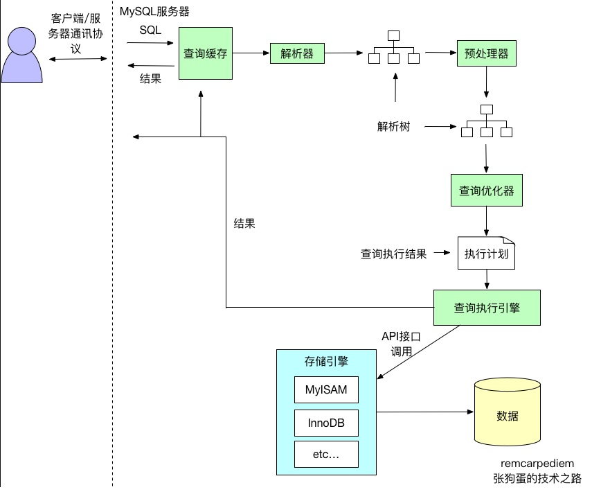
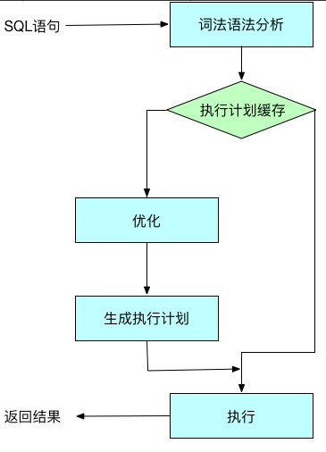

# 数据库
## 索引设计
### 如何设计合理的索引？

如果一个查询语句的索引是三星索引，那么它只需要进行一次磁盘的随机读及一个窄索引片的顺序扫描就可以得到全部的结果集
-   第一颗星需要取出所有等值谓词中的列，作为索引开头的最开始的列（任意顺序）；
    第一颗星不只是将等值谓词的列加入索引，它的作用是减少索引片的大小以减少需要扫描的数据行；
- 第二颗星需要将 ORDER BY 列加入索引中；
    	第二颗星用于避免排序，减少磁盘 IO 和内存的使用；
- 第三颗星需要将查询语句剩余的列全部加入到索引中；
    	第三颗星用于避免每一个索引对应的数据行都需要进行一次随机 IO 从聚集索引中读取剩余的数据；

## ACID是什么

| 特性                  | 描述                                                                                                                 |
| --------------------- | -------------------------------------------------------------------------------------------------------------------- |
| 原子性（Atomicity）   | 事务包含的所有操作要么全部成功，要么全部失败回滚；<br>成功必须要完全应用到数据库，失败则不能对数据库产生影响；       |
| 一致性（Consistency） | 事务执行前和执行后必须处于一致性状态                                                                                 |
| 隔离性（Isolation）   | 当多个用户并发访问数据库时，数据库为每一个用户开启的事务，不被其他事务的操作所干扰，多个并发事务之间要相互隔离；     |
| 持久性（Durability）  | 一个事务一旦被提交了，那么对数据库中的数据的改变就是永久性的，即便在数据库系统遇到故障的情况下也不会丢失事物的操作。 |


## 隔离级别


| 隔离级别                     | 描述                                                                                                                                                                                                                                                                                            | 特性                               |
| ---------------------------- | ----------------------------------------------------------------------------------------------------------------------------------------------------------------------------------------------------------------------------------------------------------------------------------------------- | ---------------------------------- |
| READ UNCIMMITTED（读未提交） | 事务中的修改，即使没有提交，其他事务也可以看得到，比如说上面的两步这种现象就叫做脏读                                                                                                                                                                                                            | 最低级别，任何情况都会发生。       |
| READ COMMITTED（读已提交）   | 大多数数据库系统的默认隔离级别是READ COMMITTED，这种隔离级别就是一个事务的开始，只能看到已经完成的事务的结果，正在执行的，是无法被其他事务看到的。这种级别会出现读取旧数据的现象                                                                                                                | 可避免脏读的发生。                 |
| Repeatable read(可重复读)    | REPEATABLE READ解决了脏读的问题，该级别保证了每行的记录的结果是一致的，也就是上面说的读了旧数据的问题，但是却无法解决另一个问题，幻行，顾名思义就是突然蹦出来的行数据。指的就是某个事务在读取某个范围的数据，但是另一个事务又向这个范围的数据去插入数据，导致多次读取的时候，数据的行数不一致。 | 可避免脏读、不可重复读的发生。     |
| Serializable(串行化)         | SERIALIZABLE是最高的隔离级别，它通过强制事务串行执行（注意是串行），避免了前面的幻读情况，由于他大量加上锁，导致大量的请求超时，因此性能会比较底下，再特别需要数据一致性且并发量不需要那么大的时候才可能考虑这个隔离级别                                                                        | 避免脏读、不可重复读，幻读的发生。 |


  - 不同隔离级别产生的问题
    | 问题       | 解释                                                                                                                                                                                                                                                                                            |
    | ---------- | ----------------------------------------------------------------------------------------------------------------------------------------------------------------------------------------------------------------------------------------------------------------------------------------------- |
    | 脏读       | 是指一个事务处理过程里读取了另一个未提交的事务中的数据，然后使用了这个数据                                                                                                                                                                                                                      |
    | 不可重复读 | 不可重复读是指在一个事务内，多次读取同一个数据，在这个事务还没有结束 ，另一个事务也访问该同一数据，但是由于第二个事务的修改，那么第一个事务两次读取的数据可能不一样，因此称为不可重复读；即同一个事务中原始数据读取不可重复。                                                                   |
    | 幻读       | 当事务不是独立执行时发生的一种现象，<br>例如：第一个事务对一个表中的数据进行修改，这种数据涉及到表中的全部数据行，同时，第二个事务也对这个表数据进行修改，这个修改是对表中新增/删除一条数据，那么操作第一个事务的用户发现表中的数据还没有修改的数据行，就好像发生了幻觉一样，这就是发生了幻读。 |
    **注:幻读和不可重复读都读取另一条已经提交的事务，所不同的是不可重复读查询的都是同一数据项，而幻读针对的是一批数据整体。**

    | 隔离级别         | 脏读 | 不可重复读 | 幻读 |
    | ---------------- | ---- | ---------- | ---- |
    | READ-UNCOMMITTED | ✔    | ✔          | ✔    |
    | READ-COMMITTED   | ✖    | ✔          | ✔    |
    | REPEATABLE-READ  | ✖    | ✖          | ✔    |
    | SERIALIZABLE     | ✖    | ✖          | ✖    |

## MVVC(Multi Version Concurrency Control多版本并发控制)
- MySQL中的InnoDB存储引擎的特性有，**默认隔离级别REPEATABLE READ**, 行级锁，实现了MVCC, Consistent nonlocking read(默认读不加锁，一致性非锁定读), Insert Buffer, Adaptive Hash Index, DoubleWrite, Cluster Index。
- Redo log, bin log, Undo log

	MySQL Innodb中存在多种日志，除了错误日志、查询日志外，还有很多和数据持久性、一致性有关的日志。
	- binlog，是mysql服务层产生的日志，常用来进行数据恢复、数据库复制，常见的mysql主从架构，就是采用slave同步master的binlog实现的, 另外通过解析binlog能够实现mysql到其他数据源的数据复制。
	- redo log记录了数据操作在物理层面的修改，mysql中使用了大量缓存，缓存存在于内存中，修改操作时会直接修改内存，而不是立刻修改磁盘，当内存和磁盘的数据不一致时，称内存中的数据为脏页(dirty page)。为了保证数据的安全性，事务进行中时会不断的产生redo log，在事务提交时进行一次flush操作，保存到磁盘中, redo log是按照顺序写入的，磁盘的顺序读写的速度远大于随机读写。当数据库或主机失效重启时，会根据redo log进行数据的恢复，如果redo log中有事务提交，则进行事务提交修改数据。这样实现了事务的原子性、一致性和持久性。
	- Undo Log除了记录redo log外，当进行数据修改时还会记录undo log，undo log用于数据的撤回操作，它记录了修改的反向操作，比如，插入对应删除，修改对应修改为原来的数据，通过undo log可以实现事务回滚，并且可以根据undo log回溯到某个特定的版本的数据，实现MVCC。
	- redo log 和binlog的一致性，为了防止写完binlog但是redo log的事务还没提交导致的不一致，innodb 使用了两阶段提交，大致执行序列为：
```python
InnoDB prepare  （持有prepare_commit_mutex）；
write/sync Binlog；
InnoDB commit (写入COMMIT标记后释放prepare_commit_mutex)。
```


### MVCC实现
- InnoDB中通过**B+树**作为索引的数据结构，并且**主键所在的索引为ClusterIndex(聚簇索引)**, ClusterIndex中的叶子节点中保存了对应的数据内容。一个表只能有一个主键，所以只能有一个聚簇索引。
- 如果表没有定义主键，则选择第一个非NULL唯一索引作为聚簇索引。
- 如果还没有则生成一个隐藏id列作为聚簇索引。 
- 除了Cluster Index外的索引是Secondary Index(辅助索引)。
    - 辅助索引中的叶子节点保存的是聚簇索引的叶子节点的值。

InnoDB行记录中除了刚才提到的rowid外，还有trx_id和db_roll_ptr, trx_id表示最近修改的事务的id,db_roll_ptr指向undo segment中的undo log。
新增一个事务时事务id会增加，trx_id能够表示事务开始的先后顺序。


## SQL执行流程
1. 客户端发送一条查询给服务器。
2. 服务器先检查查询缓存，如果命中了缓存，则立刻返回存储在缓存中的结果。否则进入下一阶段。
3. 服务器端进行SQL解析、预处理，再由优化器生成对应的执行计划。
4. MySQL根据优化器生成的执行计划，再调用存储引擎的API来执行查询。
5. 将结果返回给客户端。


### 查询缓存
- MySQL查询缓存保存查询返回的完整结构。当查询命中该缓存时，MySQL会立刻返回结果，跳过了解析、优化和执行阶段。 
- 查询缓存系统会跟踪查询中涉及的每个表，如果这些表发生了变化，那么和这个表相关的所有缓存数据都将失效。 
- MySQL将缓存存放在一个引用表中，通过一个哈希值引用，这个哈希值包括了以下因素，即查询本身、当前要查询的数据库、客户端协议的版本等一些其他可能影响返回结果的信息。 
- 当判断缓存是否命中时，MySQL不会进行解析查询语句，而是直接使用SQL语句和客户端发送过来的其他原始信息。所以，任何字符上的不同，例如空格、注解等都会导致缓存的不命中。 
- 当查询语句中有一些不确定的数据时，则不会被缓存。例如包含函数NOW()或者CURRENT_DATE()的查询不会缓存。包含任何用户自定义函数，存储函数，用户变量，临时表，mysql数据库中的系统表或者包含任何列级别权限的表，都不会被缓存。 
- 有一点需要注意，MySQL并不是会因为查询中包含一个不确定的函数而不检查查询缓存，因为检查查询缓存之前，MySQL不会解析查询语句，所以也无法知道语句中是否有不确定的函数。 事实则是，如果查询语句中包含任何的不确定的函数，那么其查询结果不会被缓存，因为查询缓存中也无法找到对应的缓存结果。 
- 缓存命中率可以通过如下公式计算：**Qcache_hits/(Qcache_hits + Com_select)**来计算。有关查询缓存的配置如下所示:
	- query_cache_type:是否打开查询缓存。可以设置为OFF、ON和DEMAND。DEMAND表示只有在查询语句中明确写明SQL_CACHE的语句才会放入查询缓存。
	- query_cache_size:查询缓存使用的总内存空间。
	- query_cache_min_res_unit:在查询缓存中分配内存块时的最小单元。较小的该值可以减少碎片导致的内存空间浪费，但是会导致更频繁的内存块操作。
	- query_cache_limit:MySQL能够查询的最大查询结果。如果查询结果大于这个值，则不会被缓存。因为查询缓存在数据生成的时候就开始尝试缓存数据，所以当结果全部返回后，MySQL才知道查询结果是否超出限制。超出之后，才会将结果从查询缓存中删除。

### 解析和预处理
- 解析器通过关键字将SQL语句进行解析，并生成对应的解析树。
- MySQL解析器将使用MySQL语法规则验证和解析查询。 
- 预处理器则根据一些MySQL规则进行进一步检查解析书是否合法，例如检查数据表和数据列是否存在，还会解析名字和别名，看看它们是否有歧义。

##### 查询优化器
- 查询优化器会将解析树转化成执行计划。
- 一条查询可以有多种执行方法，最后都是返回相同结果。优化器的作用就是找到这其中最好的执行计划。 
- 生成执行计划的过程会消耗较多的时间，特别是存在许多可选的执行计划时。
- -如果在一条SQL语句执行的过程中将该语句对应的最终执行计划进行缓存，当相似的语句再次被输入服务器时，就可以直接使用已缓存的执行计划，从而跳过SQL语句生成执行计划的整个过程，进而可以提高语句的执行速度。

- MySQL使用基于成本的查询优化器(Cost-Based Optimizer，CBO)。它会尝试预测一个查询使用某种执行计划时的成本，并选择其中成本最少的一个。 优化器会根据优化规则对关系表达式进行转换，这里的转换是说一个关系表达式经过优化规则后会生成另外一个关系表达式，同时原有表达式也会保留，经过一系列转换后会生成多个执行计划，然后CBO会根据统计信息和代价模型(Cost Model)计算每个执行计划的Cost，从中挑选Cost最小的执行计划。由上可知，CBO中有两个依赖：统计信息和代价模型。统计信息的准确与否、代价模型的合理与否都会影响CBO选择最优计划。

### 查询执行引擎
- 解析和优化阶段，MySQL将生成查询对应的执行计划，MySQL的查询执行引擎根据这个执行计划来完成整个查询。这里执行计划是一个数据结构，而不是和其他的关系型数据库那样生成对应的字节码。

### 返回结果给客户端
- 如果查询可以被缓存，那么MySQL在这个阶段页会将结果存放到查询缓存中。
- MySQL将结果集返回给客户端是一个增量、逐步返回的过程。
- 在查询生成第一条结果时，MySQL就可以开始向客户端逐步返回结果集了。


## MySQL

| 知识点         | 相关问题                     | 解析         |
| -------------- | ---------------------------- | ------------ |
| 数据类型       | char、varchar、text区别      |              |
| 索引类型       | B、B+、Hash                  |              |
| 索引设计       | 三星原则                     |              |
| InnoDB，MyISAM |                              |              |
| ACID           |                              |              |
| 悲观锁/乐观锁  |                              |              |
| MVCC           |                              | 参考下面详述 |
| 锁分类、原理   | 表锁，页锁，行锁<br />间隙锁 |              |
| 查询优化       |                              | explain      |
| 行锁算法       |                              |              |

## MVCC 

在MVCC并发控制中，读操作可以分成两类：快照读 (snapshot read)与当前读 (current read)。

 - 快照读，读取的是记录的可见版本 (有可能是历史版本)，不用加锁。

   ```sql
   select * from table where ?;
   ```

 - 当前读，读取的是记录的最新版本，并且，当前读返回的记录，都会加上锁，保证其他事务不会再并发修改这条记录。

   ```sql
   select * from table where ? lock in share mode; -- S锁 (共享锁)
   select * from table where ? for update; -- X锁 (排它锁)
   insert into table values (…); -- X锁 (排它锁)
   update table set ? where ?; -- X锁 (排它锁)
   delete from table where ?; -- X锁 (排它锁)
   ```

   ***为什么将 插入/更新/删除 操作，都归为当前读？***


```sequence
   Title: "update table set ? where ?"
   MySQL Server->InnoDB: current read(round 1)
   InnoDB-->MySQL Server: return & lock(round 1)
   MySQL Server->InnoDB: update row(round 1)
   InnoDB-->MySQL Server: success(round 1)
   Note over MySQL Server,InnoDB: round N
```

delete操作也如上图所示，Insert操作会稍微有些不同，简单来说，就是Insert操作可能会触发Unique Key的冲突检查，也会进行一个当前读。

**注**：<u>根据上图的交互，针对一条当前读的SQL语句，InnoDB与MySQL Server的交互，是一条一条进行的，因此，加锁也是一条一条进行的。先对一条满足条件的记录加锁，返回给MySQL Server，做一些DML操作；然后在读取下一条加锁，直至读取完毕。</u>

| 隔离级别                 | 备注                                                                                                                                                                                                         |
| ------------------------ | ------------------------------------------------------------------------------------------------------------------------------------------------------------------------------------------------------------ |
| **Read Uncommited**      | 可以读取未提交记录。此隔离级别，不会使用，忽略。                                                                                                                                                             |
| **Read Committed (RC)**  | 快照读忽略，本文不考虑。<br />针对当前读，RC隔离级别保证对读取到的记录加锁 (记录锁)，存在幻读现象。                                                                                                          |
| **Repeatable Read (RR)** | 快照读忽略，本文不考虑。<br />针对当前读，RR隔离级别保证对读取到的记录加锁 (记录锁)，同时保证对读取的范围加锁，新的满足查询条件的记录不能够插入 (间隙锁)，不存在幻读现象。                                   |
| **Serializable**         | 从MVCC并发控制退化为基于锁的并发控制。不区别快照读与当前读，所有的读操作均为当前读，读加读锁 (S锁)，写加写锁 (X锁)。<br />Serializable隔离级别下，读写冲突，因此并发度急剧下降，在MySQL/InnoDB下不建议使用。 |

##### 行锁算法


- Record Lock
- Gap Lock
- Next-Key Lock

**参考资料**：

[MySQL 加锁处理分析](http://hedengcheng.com/?p=771)


##### 读写分离

**数据库读写分离的基本实现如下:**

1. 数据库服务器搭建主从集群，一主一从，一主多从都可以
2. 数据库主机负责读写操作，从机只负责读操作
3. 数据库主机通过复制将数据同步到从机，每台数据库服务器都存储了所有的业务数据
4. 业务服务器将写操作分给数据库主机，将读操作分给数据库从机

**实现方式：**

1. 程序代码封装
2. 中间件封装

##### 分库分表

**业务分库：**业务分库指的是`按照业务模块将数据分散到不同的数据库服务器`。例如，一个简单的电商网站，包括商品，订单，用户三个业务模块，我们可以将商品数据，订单数据，用户数据，分开放到3台不同的数据库服务器上，而不是将所有数据都放在一台数据库服务器上。引入问题如下：

- `join操作问题`：业务分库后，原本在同一个数据库中的表分散到不同数据库中，导致无法使用SQL的join查询
- `事务问题`：原本在同一个数据库中不同的表可以在同一个事务中修改，业务分库后，表分散到不同数据库中，无法通过事务统一修改
- `成本问题`：业务分库同时也带来了成本的代价，本来1台服务器搞定的事情，现在要3台，如果考虑备份，那就是2台变成6台

**分表**

- 垂直分表
  垂直分表适合将表中某些不常用且占了大量空间的列拆分出去。如上图的nickname和description字段不常用，就可以将这个字段独立到另外一张表中，这样在查询name时，就能带来一定的性能提升
- 水平分表
  水平分表适合表行数特别大的表，如果单表行数超过5000万就必须进行分表，这个数字可以作为参考，但并不是绝对标准，关键还是要看表的访问性能
  水平分表后，某条数据具体属于哪个切分后的子表，需要增加路由算法进行计算，常见的**路由算法**有：
  - **范围路由**：选取有序的数据列（例如，整型，时间戳等）作为路由条件，不同分段分散到不同的数据库表中。以最常见的用户ID为例，路由算法可以按照1000000的范围大小进行分段，1-999999放到数据库1的表中，1000000-1999999放到数据库2的表中，以此类推
  - **Hash路由**：选取某个列（或者某几个列组合也可以）的值进行Hash运算，然后根据Hash结果分散到不同的数据库表中。同样以用户Id为例，假如我们一开始就规划了10个数据库表，路由算法可以简单地用user_id%10的值来表示数据所属的数据库表编号，ID为985的用户放到编号为5的子表中，ID为10086的用户放到编号为6的子表中。
  - **配置路由**：配置路由就是路由表，用一张独立的表来记录路由信息，同样以用户ID为例，我们新增一张user_router表，这个表包含user_id和table_id两列，根据user_id就可以查询对应的table_id

## RR vs RC
```sql
CREATE TABLE `test` (
`id` int(11) NOT NULL,
`color` varchar(20) NOT NULL,
PRIMARY KEY (`id`)
) ENGINE=InnoDB;
+----+-------+
| id | color |
+----+-------+
|  1 |  red  |
|  2 | white |
|  5 |  red  |
|  7 | white |
+----+-------+
```
### 为使用RC？
1. 在RR隔离级别下，存在间隙锁，导致出现死锁的几率比RC大的多！</br> 
   此时执行如下语句。在RR隔离级别下，存在间隙锁，可以锁住(2,5)这个间隙，防止其他事务插入数据！ 而在RC隔离级别下，不存在间隙锁，其他事务是可以插入数据！ <br>
   <u>ps: 在RC隔离级别下并不是不会出现死锁，只是出现几率比RR低而已！</u>
```sql
  select * from test where id <3 for update;
```

2. 在RR隔离级别下，条件列未命中索引会锁表！而在RC隔离级别下，只锁行 此时执行如下语句，在RC隔离级别下，其先走聚簇索引，进行全部扫描。
```sql 
update test set color = 'blue' where color = 'white';
```

3. 在RC隔离级别下，**半一致性读**(semi-consistent)特性增加了update操作的并发性！ 在5.1.15的时候，innodb引入了一个概念叫做“semi-consistent”，减少了更新同一行记录时的冲突，减少锁等待。 <br>
所谓半一致性读就是，一个update语句，如果读到一行已经加锁的记录，此时InnoDB返回记录最近提交的版本，由MySQL上层判断此版本是否满足update的where条件。若满足(需要更新)，则MySQL会重新发起一次读操作，此时会读取行的最新版本(并加锁)


## B树的原理
- 定义:
    - 根结点至少有两个子女。
	- 每个中间节点都包含k-1个元素和k个孩子，其中 m/2 <= k <= m
	- 每一个叶子节点都包含k-1个元素，其中 m/2 <= k <= m
	- 所有的叶子结点都位于同一层。
	- 每个节点中的元素从小到大排列，节点当中k-1个元素正好是k个孩子包含的元素的值域分划。
