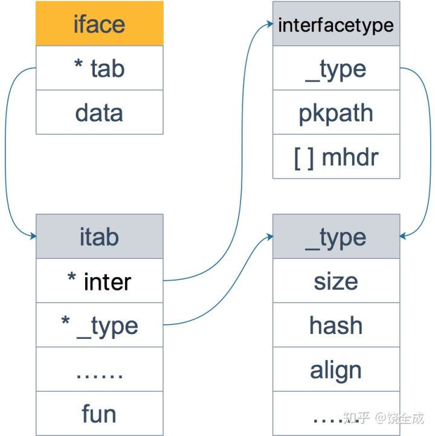
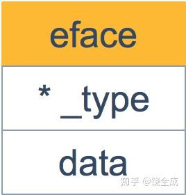

golang interface

---

### Go语言与验资类型的关系

```python
def hello_world(coder):
    coder.say_hello()
```

当调用此函数的时候，可以传入任意类型，只要它实现了 `say_hello()` 函数就可以。如果没有实现，运行过程中会出现错误。而在静态语言如 Java, C++ 中，必须要显示地声明实现了某个接口，之后，才能用在任何需要这个接口的地方。

Go引入了动态语言的便利，同时又会进行静态语言的类型检查。Go 采用了折中的做法：不要求类型显示地声明实现了某个接口，只要实现了相关的方法即可，编译器就能检测到。

```go
type IGreeting interface {
    sayHello()
}

func sayHello(i IGreeting) {
    i.sayHello()
}
```

```text
type Go struct {}
func (g Go) sayHello() {
    fmt.Println("Hi, I am GO!")
}

type PHP struct {}
func (p PHP) sayHello() {
    fmt.Println("Hi, I am PHP!")
}

func main() {
    golang := Go{}
    php := PHP{}

    sayHello(golang)
    sayHello(php)
}
/*
Hi, I am GO!
Hi, I am PHP!
*/
```

### 值接受者和指针接受者的区别

#### 方法

当类型和方法的接收者类型不同时，其实是编译器在背后做了一些工作，用一个表格来呈现：

| -              | 值接受者                                 | 指针接受者                              |
| -------------- | ---------------------------------------- | --------------------------------------- |
| 值类型调用者   | 方法会使用调用者的一个副本，类似于“传值” | 使用值来调用方法，st.Do实际上是(&st).Do |
| 指针类型调用者 | 指针被引用为值，st.Do实际上是(*st).Do    | 实际上也是“传值”，拷贝指针              |


#### 值接受者和指针接受者

```go
package main

import "fmt"

type coder interface {
    code()
    debug()
}

type Gopher struct {
    language string
}

func (p Gopher) code() {
    fmt.Printf("I am coding %s language\n", p.language)
}

func (p *Gopher) debug() {
    fmt.Printf("I am debuging %s language\n", p.language)
}

func main() {
    var c coder = &Gopher{"Go"}
    c.code()
    c.debug()
    var c2 coder = Gopher{"Go"}
    c2.code()
    c2.debug()  // compile error
}


```

如果方法的接收者是值类型，无论调用者是对象还是对象指针，修改的都是对象的副本，不影响调用者；如果方法的接收者是指针类型，则调用者修改的是指针指向的对象本身。

使用指针作为方法的接收者的理由：

- 方法能够修改接收者指向的值。
- 避免在每次调用方法时复制该值，在值的类型为大型结构体时，这样做会更加高效。

### iface与eface的区别

```go
type iface struct {
    tab  *itab
    data unsafe.Pointer
}

type itab struct {
    inter  *interfacetype // 接口的类型
    _type  *_type  // 实体的类型，包括内存对齐方式，大小等
    link   *itab
    hash   uint32 // copy of _type.hash. Used for type switches.
    bad    bool   // type does not implement interface
    inhash bool   // has this itab been added to hash?
    unused [2]byte
    fun    [1]uintptr // variable sized
}
```

`iface` 内部维护两个指针，`tab` 指向一个 `itab` 实体， 它表示接口的类型以及赋给这个接口的实体类型。`data` 则指向接口具体的值，一般而言是一个指向堆内存的指针。

再来仔细看一下 `itab` 结构体：

 - `_type` 字段描述了实体的类型，包括内存对齐方式，大小等

 - `inter` 字段则描述了接口的类型。

 - `fun` 字段放置和接口方法对应的具体数据类型的方法地址，实现接口调用方法的动态分派，一般在每次给接口赋值发生转换时会更新此表，或者直接拿缓存的 itab。

   

   ```go
   type interfacetype struct {
       typ     _type
       pkgpath name
       mhdr    []imethod
   }
   ```

   它包装了 `_type` 类型，`_type` 实际上是描述 Go 语言中各种数据类型的结构体。我们注意到，这里还包含一个 `mhdr` 字段，表示接口所定义的函数列表， `pkgpath` 记录定义了接口的包名。

   

   

eface

```go
type eface struct {
    _type *_type
    data  unsafe.Pointer
}
```



```go
package main

import "fmt"
type coder interface {
    code()
    debug()
}

type Gopher struct {
    language string
}

func (p Gopher) code() {
    fmt.Printf("I am coding %s language\n", p.language)
}

func (p Gopher) debug() {
    fmt.Printf("I am debuging %s language\n", p.language)
}

func main() {
    x := 200
    var any interface{} = x
    fmt.Println(any)

    g := Gopher{"Go"}
    var c coder = g
    fmt.Println(c)
}
```

```shell
go tool compile -S ./src/main.go
```

```go
func convT2E(t *_type, elem unsafe.Pointer) (e eface)
func convT2I(tab *itab, elem unsafe.Pointer) (i iface)
```

```go
type _type struct {
    // 类型大小
    size       uintptr
    ptrdata    uintptr
    // 类型的 hash 值
    hash       uint32
    // 类型的 flag，和反射相关
    tflag      tflag
    // 内存对齐相关
    align      uint8
    fieldalign uint8
    // 类型的编号，有bool, slice, struct 等等等等
    kind       uint8
    alg        *typeAlg
    // gc 相关
    gcdata    *byte
    str       nameOff
    ptrToThis typeOff
}
```

Go 语言各种数据类型都是在 `_type` 字段的基础上，增加一些额外的字段来进行管理的：

```go
type arraytype struct {
    typ   _type
    elem  *_type
    slice *_type
    len   uintptr
}

type chantype struct {
    typ  _type
    elem *_type
    dir  uintptr
}

type slicetype struct {
    typ  _type
    elem *_type
}

type structtype struct {
    typ     _type
    pkgPath name
    fields  []structfield
}
```

### 接口的动态类型和动态值

`iface`包含两个字段：`tab` 是接口表指针，指向类型信息；`data` 是数据指针，则指向具体的数据。它们分别被称为`动态类型`和`动态值`。而接口值包括`动态类型`和`动态值`。

接口值的零值是指`动态类型`和`动态值`都为 `nil`。当仅且当这两部分的值都为 `nil` 的情况下，这个接口值就才会被认为 `接口值 == nil`。

```go
package main

import "fmt"

type Coder interface {
    code()
}

type Gopher struct {
    name string
}

func (g Gopher) code() {
    fmt.Printf("%s is coding\n", g.name)
}

func main() {
    var c Coder
    fmt.Println(c == nil)  // true
    fmt.Printf("c: %T, %v\n", c, c) // nil nil

    var g *Gopher
    fmt.Println(g == nil) // true

    c = g
    fmt.Println(c == nil) // false
    fmt.Printf("c: %T, %v\n", c, c) // *main.Gohper nil
}
```

```go
package main

import "fmt"

type MyError struct {}

func (i MyError) Error() string {
    return "MyError"
}

func main() {
    err := Process()
    fmt.Println(err)  // nil

    fmt.Println(err == nil)  // false
}

func Process() error {
    var err *MyError = nil
    return err
}
```

这里先定义了一个 `MyError` 结构体，实现了 `Error` 函数，也就实现了 `error` 接口。`Process`函数返回了一个 `error` 接口，这块隐含了类型转换。所以，虽然它的值是 `nil`，其实它的类型是 `*MyError`，最后和 `nil` 比较的时候，结果为 `false`。

```go
package main

import (
    "unsafe"
    "fmt"
)

type iface struct {
    itab, data uintptr
}

func main() {
    var a interface{} = nil
    var b interface{} = (*int)(nil)

    x := 5
    var c interface{} = (*int)(&x)

    ia := *(*iface)(unsafe.Pointer(&a))
    ib := *(*iface)(unsafe.Pointer(&b))
    ic := *(*iface)(unsafe.Pointer(&c))

    fmt.Println(ia, ib, ic)
    fmt.Println(*(*int)(unsafe.Pointer(ic.data)))
}
```

### 编译器自动检测类型是否实现接口

疑问：

```go
var _ io.Writer = (*myWriter)(nil) // what ?
```

### 接口的构造过程

```go
package main

import "fmt"

type Person interface {
    growUp()
}

type Student struct {
    age int
}

func (p Student) growUp() {
    p.age += 1
    return
}

func main() {
    var qcrao = Person(Student{age: 18})
    fmt.Println(qcrao)
}
```

```ass

```

### 类型转换和断言的区别


### Reference:

[深度解密Go语言之关于 interface 的10个问题](<https://zhuanlan.zhihu.com/p/63649977>)

