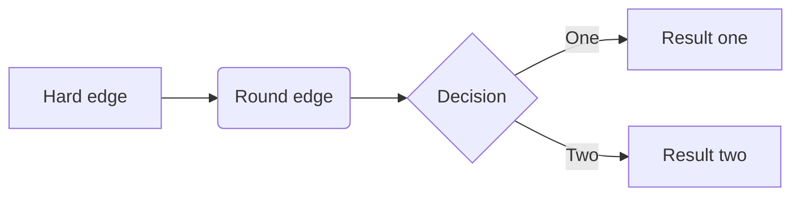

###summary

#### 高并发理解：
简要总结梳理下，7点：
1. 逻辑剥离，只保留核心部分，而把附加功能剔除出去
	生成订单、扣除资金、库存扣减。
	非核心部分，短信发送、消息通知、销售统计、订单搜索等，通过MQ保证。

2. 提高数据库事务并发
	要提高数据库的事务并发数，最有效的办法是拆分，拆分有两种，一是对库进行拆分，另一种是在同一个库中对表进行拆分。
	数据库写库，通常只有1个，为了保证数据绝对一致。
	单个数据库的写库、并发性，有很大限制，通过分库16个、分表16*64=1024个。
	分库分表依据，订单号后4位，取模%1024。
	当当网开源的sharding-jdbc挺不错的。

3. 买家和卖家2个维度
	买家是1套库。 新增订单后，再发送MQ消息+定期对数据，同步到卖家库。

4. 历史数据
	3个月前的老数据迁移到其它库中。 用户查询时，分2次查询汇总。

5. 全数据的统计
	数据迁移到全量库中。难道是HBase之类的？

6. 搜索
	搜索和统计有点类似。 ElasticSearch。  京东淘宝都是10亿级别了吧。

7. 其它优化
	数据库、磁盘IO、服务器硬件稳定、压力测试

#### 内存泄露分析


----

#### Redis

| 知识点        | 相关问题                                                                                                                       | 解析                                                                                                                                                                                                  |
| ------------- | ------------------------------------------------------------------------------------------------------------------------------ | ----------------------------------------------------------------------------------------------------------------------------------------------------------------------------------------------------- |
| rehash        |                                                                                                                                |                                                                                                                                                                                                       |
| 常用数据类型  |                                                                                                                                | string、list、hash、zset、set、bit、pub/sub、hyperloglog、geo、bloomfilter                                                                                                                            |
| 分布式锁      |                                                                                                                                | 详见下面描述                                                                                                                                                                                          |
| 过期策略      |                                                                                                                                |                                                                                                                                                                                                       |
| redis缓存穿透 | 缓存击穿表示恶意用户模拟请求很多缓存中不存在的数据，由于缓存中都没有，导致这些请求短时间内直接落在了数据库上，导致数据库异常。 | **1、使用互斥锁排队**<br />**2、布隆过滤器（推荐）**                                                                                                                                                  |
| redis缓存雪崩 | 缓存在同一时间内大量键过期（失效），接着来的一大波请求瞬间都落在了数据库中导致连接异常。                                       | **1、使用互斥锁排队**<br />**2、建立备份缓存，缓存A和缓存B，A设置超时时间，B不设值超时时间，先从A读缓存，A没有读B，并且更新A缓存和B缓存;**<br />**3、key不要设置同时失效，固定缓存时间+随机时间解决** |
| redis缓存并发 | 一个缓存如果失效，可能出现多个进程同时查询DB，同时设置缓存的情况，如果并发确实很大，这也可能造成DB压力过大                     |                                                                                                                                                                                                       |

##### 分布式锁

使用 **setnx**(set if not exists) 指令，只允许被一个客户端设置成功（这里利用redis“单线程”特性），使用完之后，再调用 del 指令释放。

```python
redis.setnx("mylock", 1)
# do something
redis.delete("mylock")
```

如果程序出现异常，没机会调用del，那么就会陷入死锁，也就凉凉了。

于是我们想在拿到锁之后设置expire，变成如下流程

```python
redis.setnx("mylock", 1)
redis.expire("mylock", 3) # 需要毫秒级别可以使用pexpire
# do something
redis.delete("mylock")
```

还是不够严谨，如果再setnx之后，没来得及设置超时，挂掉了，之前的问题还存在，并没有完全解决掉。这种问题的根源就在于setnx和expire不是原子操作。也许会想到使用redis事物解决，但这里不行，因为expire是依赖于setnx的执行结果。于是Redis 2.8 版本中作者加入了 set 指令的扩展参数，setnx 和 expire 组合成原子指令

```python
redis.set("mylock", 1, ex=3, nx=True)
# do something
redis.delete("mylock")
```

以为用了扩展的set就万事大吉了，简直too youngh。这个分布式锁并不能解决**超时问题**，如果加锁和释放锁之间执行时间太长，以至于超出了锁的时限，就出两个问题，`1. 后来者拿到了本不该拿到的锁 2. 先来者可能释放掉已不属于它的锁。`为了避免这个问题，Redis锁不要用于较长时间的任务。

有个稍微安全一点的做法为set 指令的 value 参数设置为一个随机数，释放锁前先匹配值是否一致，然后再删除，可以确保当前占有的锁不会被其它释放，除非这个锁是过期了被服务器自动释放的。 但是匹配 value 和删除 key 不是一个原子操作，Redis 也没有提供类似于`delIfEquals`这样的指令，这就需要使用 Lua 脚本来处理了，因为 Lua 脚本可以保证连续多个指令的原子性执行。这个方法还是有缺陷的，它只解决了上述问题中的2，1并没有得到解决。

```python
if redis.set(key, random.nextint(), nx=True, ex=3):
    # do something
    redis.delIfEquals(key, tag)  # 假想的 delIfEquals 指令
```

锁发展到这一步，还有一个问题有待解决**`可重入性`**，可重入相关概念参考操作系统一节相关内容。解决方法大概思路：对当前流程拿到的redis锁做本地记录，申请redis锁之前先判断当前流程是否已拥有这个锁，并做引用计数+1，释放锁时先将引用计数-1，如果操作后值为0，则将redis锁释放掉。

```sequence
Title: "加锁流程"
routine->localRefNum: current refNum
localRefNum->routine: refNum
routine->localRefNum: refNum+1（refNum != 0）
localRefNum->routine: 取得锁
routine-->redis: set申请锁（refNum == 0）
redis-->routine: 取得锁
routine-->localRefNum: 设置localRefNum 1
```

```sequence
Title: "放锁流程"
routine->localRefNum: current refNum
localRefNum->routine: refNum
routine->localRefNum: refNum-1
routine-->redis: del释放锁（refNum == 0）
redis-->routine: 取得锁
```

到了这一步我能说还有问题吗？:cry:

在集群环境中，原先在mster中申请成功的锁，还没有来得及同步到slave，master挂掉时，slave会顶上，客户端上却并没明显感知，新的节点内部没有这个锁，所以另一个过来请求加锁时，立即就批准了。这样就会导致系统中同样一把锁被两个客户端同时持有。那么怎么解决这个问题呢？

---


```flow
main=>start: main
initServer=>operation: initServer
createTime=>operation: aeCreateTimeEvent
serverCron=>operation: serverCron
databasesCron=>operation: databasesCron
activeExpireCycle=>operation: activeExpireCycle
activeExpireCycleTryExpire=>operation: activeExpireCycleTryExpire
lazyfree_lazy_expire=>condition: lazyfree_lazy_expire?
dbSyncDelete=>operation: dbSyncDelete
dbAsyncDelete=>operation: dbAsyncDelete
main(right)->initServer(right)->createTime(right)->serverCron->databasesCron->activeExpireCycle->activeExpireCycleTryExpire->lazyfree_lazy_expire
lazyfree_lazy_expire(yes)->dbAsyncDelete
lazyfree_lazy_expire(no)->dbSyncDelete
```

```c
int activeExpireCycleTryExpire(redisDb *db, dictEntry *de, long long now) {
    long long t = dictGetSignedIntegerVal(de);
    if (now > t) {
        sds key = dictGetKey(de);
        robj *keyobj = createStringObject(key,sdslen(key));

        propagateExpire(db,keyobj,server.lazyfree_lazy_expire);
        if (server.lazyfree_lazy_expire)
            dbAsyncDelete(db,keyobj);
        else
            dbSyncDelete(db,keyobj);
        notifyKeyspaceEvent(NOTIFY_EXPIRED,
            "expired",keyobj,db->id);
        decrRefCount(keyobj);
        server.stat_expiredkeys++;
        return 1;
    } else {
        return 0;
    }
}
```


----

----

#### 算法

| 大类     | 使用原则 | 细化                                             | 例子     |
| -------- | -------- | ------------------------------------------------ | -------- |
| 分治法   |          |                                                  | 快速排序 |
| 减治法   |          |                                                  | 插入排序 |
| 动态规划 |          |                                                  | 斐波那契 |
| 暴力枚举 |          |                                                  |          |
| BFS/DFS  |          |                                                  |          |
| 双指针   |          |                                                  |          |
| 排序     |          | 选择，冒泡，插入，快速，归并，希尔，基数，堆排序 |          |
| 递归     |          |                                                  | 汉诺塔   |

##### 双指针

给定一个数组和一个值，原地删除该值的所有实例并返回新的长度。

如果我们没有空间复杂度上的限制，那就更容易了。我们可以初始化一个新的数组来存储答案。如果元素不等于给定的目标值，则迭代原始数组并将元素添加到新的数组中。
实际上，它相当于使用了两个指针，一个用于原始数组的迭代，另一个总是指向新数组的最后一个位置。

```go
// 给定一个数组 nums 和一个值 val，你需要原地移除所有数值等于 val 的元素，返回移除后数组的新长度。
func removeElement(nums []int, val int) int {
    ans := 0
    for i, v := range nums{
        if v != val {
            nums[ans] = nums[i]
            ans ++
        }
    }
    
    return ans
}
```




----

####数据结构

| 大类         | 细化                   | 实现 | 题                             |
| ------------ | ---------------------- | ---- | ------------------------------ |
| 数组         |                        |      |                                |
| 链表         |                        |      | 链表逆序，链表环检测           |
| 队列         |                        |      |                                |
| 跳表         |                        |      |                                |
| 二叉树       |                        |      | 先序，中序，后序，层序，树高度 |
| 平衡二叉树   | AVL，RB                |      |                                |
| 基数树       |                        |      |                                |
| trie         |                        |      |                                |
| B树          |                        |      |                                |
| B+树         |                        |      |                                |
| 堆           |                        |      | topk，堆排序                   |
| Treap        | Tree + Heap            |      |                                |
| 并查集       |                        |      |                                |
| 栈           |                        |      | 括号匹配，带最小函数的栈       |
| Hash         | 开放地址法<br />链表法 |      |                                |
| 一致性Hash   | vnode                  |      |                                |
| Bloom Filter |                        |      |                                |
| 图           |                        |      |                                |
| 字符串处理   |                        |      | 字符串匹配                     |

----

#### 分布式

| 知识点     | 解析     |
| ---------- | -------- |
| CAP        |          |
| BASE       |          |
| 两段式提交 |          |
| 三段式提交 |          |
| Paxos      |          |
| Raft       |          |
| 分布式事物 |          |
| 相关组件   | zk，etcd |


#### 语言

| 语言 | 考点                                                                                                     |                                                                                                                                                                                                                                                                                           |
| ---- | -------------------------------------------------------------------------------------------------------- | ----------------------------------------------------------------------------------------------------------------------------------------------------------------------------------------------------------------------------------------------------------------------------------------- |
| GO   | slice，map，channel实现<br />GC，协程调度<br />defer<br />协程实现<br />性能分析（profile， trace）      |                                                                                                                                                                                                                                                                                           |
| C++  | 虚函数，虚表<br />设计模式<br />Modern C++<br />模板<br />static用法<br />STL<br />shared_ptr<br />Boost | 理解对象的内存布局，即可理解虚函数，虚表<br />常用设计模式，单例（较重要，会手写），工厂（连接池），观察者（pub/sub），装饰器<br />C++11，lambda，auto，final<br />可变参数模板<br />修饰变量，修饰函数，修饰类成员<br />vector，list，map，unordered_map（hash map），set，unordered_set |

#### 操作系统

| 知识点           | 解析 | 考题         |
| ---------------- | ---- | ------------ |
| 进程，线程，协程 |      |              |
| 内存，cpu缓存    |      | 内存拷贝优化 |
| 文件系统         |      | 关闭swap     |
| 信号             |      | kill实现原理 |
| 磁盘             |      | 页缓存       |
| 线程安全vs可重入 |      |              |

#### 网络

| 知识点              | 解析 | 考题                                                          |
| ------------------- | ---- | ------------------------------------------------------------- |
| 三次握手            |      |                                                               |
| 四次挥手            |      |                                                               |
|                     |      |                                                               |
| sync队列，就绪队列  |      |                                                               |
| 网络优化            |      |                                                               |
| epoll、poll、select |      | poll、select、epoll比较<br />epoll高效原因<br />epoll有啥缺点 |
| TIME_WAIT           |      |                                                               |

##### 三次握手

```sequence
client->server: sync(i)
server->client: sync(i+1) ack(j)
client->server: ack(j+1)
```


#### 常用组件

| 组件       | 使用场景 |
| ---------- | -------- |
| etcd       |          |
| kong       |          |
| zipkin     |          |
| prometheus |          |
| kafka      |          |
| nginx      |          |

#### 架构

| 知识点   | 解析 |
| -------- | ---- |
| failover |      |


#### 常见题目

1. 单例模式

   ```c++
   #include <pthread.h>
   
   // 单线程版
   namespace v1 {
       class singleton {
           private:
               static singleton* p;  
               singleton(){}  // 防止被外部实例化
           public:
               static singleton* instance();
       };
   
       singleton* singleton::p = nullptr;
       singleton* singleton::instance() {
           if (p == nullptr) {
               p = new singleton();
           }
           return p;
       }
   }
   
   // 加锁的经典懒汉实现
   namespace v2 {
       class singleton {
           protected:
               singleton() {
                   pthread_mutex_init(&mutex, nullptr);
               }
           private:
               static singleton* p;
           public:
               static pthread_mutex_t mutex;
               static singleton* initance();
       };
   
       pthread_mutex_t singleton::mutex;
       singleton* singleton::p = nullptr;
       singleton* singleton::initance() {
           if (p == nullptr) {
               pthread_mutex_lock(&mutex);
               if (p == nullptr) {
                   p = new singleton();
               }
               pthread_mutex_unlock(&mutex);
           }
           return p;
       }
   }
   
   // 内部静态变量的懒汉实现
   namespace v3 {
       class singleton {
           protected:
               singleton() {
                   pthread_mutex_init(&mutex, nullptr);
               }
           public:
               static pthread_mutex_t mutex;
               static singleton* initance();
       };
   
       pthread_mutex_t singleton::mutex;
       singleton* singleton::initance() {
           pthread_mutex_lock(&mutex);
           static singleton obj;
           pthread_mutex_unlock(&mutex);
           return &obj;
       }
   }
   
   // 饿汉实现 
   namespace v4 {
       class singleton {
           protected:
               singleton() {}
           private:
               static singleton* p;
           public:
               static singleton* initance();
       };
       singleton* singleton::p = new singleton; // 进入主函数之前就由主线程以单线程方式完成了初始化
       singleton* singleton::initance() {
           return p;
       }
   }
   ```

2. 链表有环检测

   ```c++
   // 时间复杂度O(n)，空间复杂度O(n)
   class Solution {
   public:
       bool hasCycle(ListNode *head) {
           unordered_set<ListNode*> s;
           
           while (head) {
               auto v = s.find(head);
               if (v != s.end()) {
                   return true;
               }
               s.insert(head);
               head = head->next;
           }
           
           return false;
       }
   };
   
   // 时间复杂度O(n)，空间复杂度O(1)
   class Solution {
   public:
       bool hasCycle(ListNode *head) {
           if (head == nullptr) {
       		return false;
       	}
   
       	ListNode *fast = head;
       	ListNode *slow = head;
   
       	while (fast->next != nullptr) {
       		fast = fast->next->next;
       		if (fast == nullptr) {
       			return false;
       		}
   
       		slow = slow->next;
       		if (fast == slow) {
       			return true;
       		}
       	}
       	return false;
       }
   };
   ```

3. 链表原地逆序

   ```c++
   class Solution {
       public:
           ListNode* reverseList(ListNode* head) {
               if (head == NULL) {
                   return head;
               }
               ListNode* curr = head;
               ListNode* next = head->next;
               head->next = NULL;
               ListNode* tmp = NULL;
               while (next != NULL) {
                   tmp = next->next;
                   next->next = curr;
                   curr = next;
                   next = tmp;
               }
               return curr;
           }
   
   };
   ```

4. 二叉树先序遍历
   递归、非递归两种方法。递归较容易，所以只提供非递归的答案

   ```c++
   class Solution {
       public:
           vector<int> preorderTraversal(TreeNode* root) {
               vector<int> ans;
               stack<TreeNode*> s;
               while (root != nullptr || !s.empty()) {
                   if (root) {
                       ans.push_back(root->val);
                       if (root->right != nullptr) {
                           s.push(root->right);
                       }    
                       if (root->left != nullptr) {
                           s.push(root->left);
                       } 
                   } else {
                       root = s.top();
                       s.pop();
                       ans.push_back(root->val);
                       if (root->right != nullptr) {
                           s.push(root->right);
                       }    
                       if (root->left != nullptr) {
                           s.push(root->left);
                       } 
                   }
                   root = nullptr;
               }
               return ans;
           }
   };
   ```

5. 二叉树中序遍历

6. 二叉树后续遍历

   ```c++
   class Solution {
       public:
           vector<int> postorderTraversal(TreeNode* root) {
               vector<int> ans;
               stack<pair<TreeNode*, int>> s;
   
               if (root == nullptr) {
                   return ans;
               }
   
               s.push(pair<TreeNode*, int>(root, 1));
   
               while (!s.empty()) {
                   auto e = s.top();
                   s.pop();
                   if (e.second == 2) {
                       ans.push_back(e.first->val);
                   } else {
                       s.push(pair<TreeNode*, int>(e.first, e.second+1));
                       if (e.first->right) {
                           s.push(pair<TreeNode*, int>(e.first->right, 1));
                       }
                       if (e.first->left) {
                           s.push(pair<TreeNode*, int>(e.first->left, 1));
                       }
                   }
               }
               return ans;
           }
   
   };
   ```

7. 二叉树层序遍历

   ```c++
   class Solution {
   public:
       vector<vector<int>> levelOrder(TreeNode* root) {
           vector<vector<int>> result;
           if (nullptr == root) {
               return result;
           }
           queue<TreeNode*> q;
           TreeNode* n;
           q.push(root);
           while (!q.empty()) {
               vector<int> level;
               size_t count = q.size();
               while (count --) {
                   n = q.front();
                   level.push_back(n->val);
                   q.pop();
                   
                   if (n->left) {
                       q.push(n->left);
                   }
                   if (n->right){
                       q.push(n->right);
                   }
               }
               result.push_back(level);
           }
           return result;
       }
   };
   ```

8. BFS

9. DFS

10. 链表中倒数第K个节点

    ```c++
    class Solution {
    public:
        ListNode* removeNthFromEnd(ListNode* head, int n) {
            if (head == nullptr) {
                return nullptr;
            }
            ListNode* front = head;
            while (n && front) {
                front = front->next;
                n --;
            }
            if (front) {
                front = front->next;
            }else {
                return head->next;
            }
            ListNode* back = head;
            while (front) {
                back = back->next;
                front = front->next;
            }
            if (back && back->next) {
                back->next = back->next->next;
            } else {
                return nullptr;
            }
            return head;
        }
    };
    ```

11. 包含min函数的栈

    ```c++
    class MinStack {
        public:
            /** initialize your data structure here. */
            MinStack() { }
    
            void push(int x) {
                m_data.push(x);
                if (m_min.empty() || x <= m_min.top()) {
                    m_min.push(x);
                }
            }
    
            void pop() {
                if (m_data.top() == m_min.top()) {
                    m_min.pop();
                }
                m_data.pop();
            }
    
            int top() {
                return m_data.top();
            }
    
            int getMin() {
                return m_min.top();
            }
        private:
            stack<int> m_data;
            stack<int> m_min;
    
    };
    ```

12. 找出数组中超过一半元素

    ```c++
    class Solution {
    public:
        // 每找出两个不同的element，则成对删除。最终剩下的一定就是所求的。
        int majorityElement(vector<int>& nums) {
            int cnt = 0;
            int ans;
            
            for (auto x : nums) {
                if (cnt == 0) {
                    ans = x;
                    cnt ++;
                } else if (ans == x) {
                    cnt ++;
                } else {
                    cnt --;
                }
            }
            
            return ans;
        }
    };
    ```
