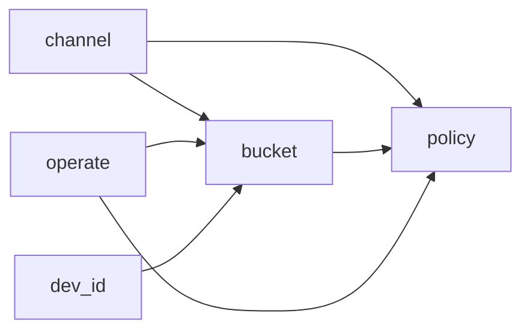
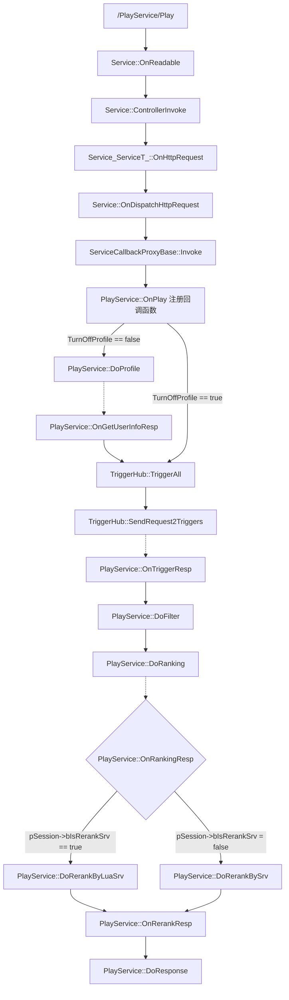
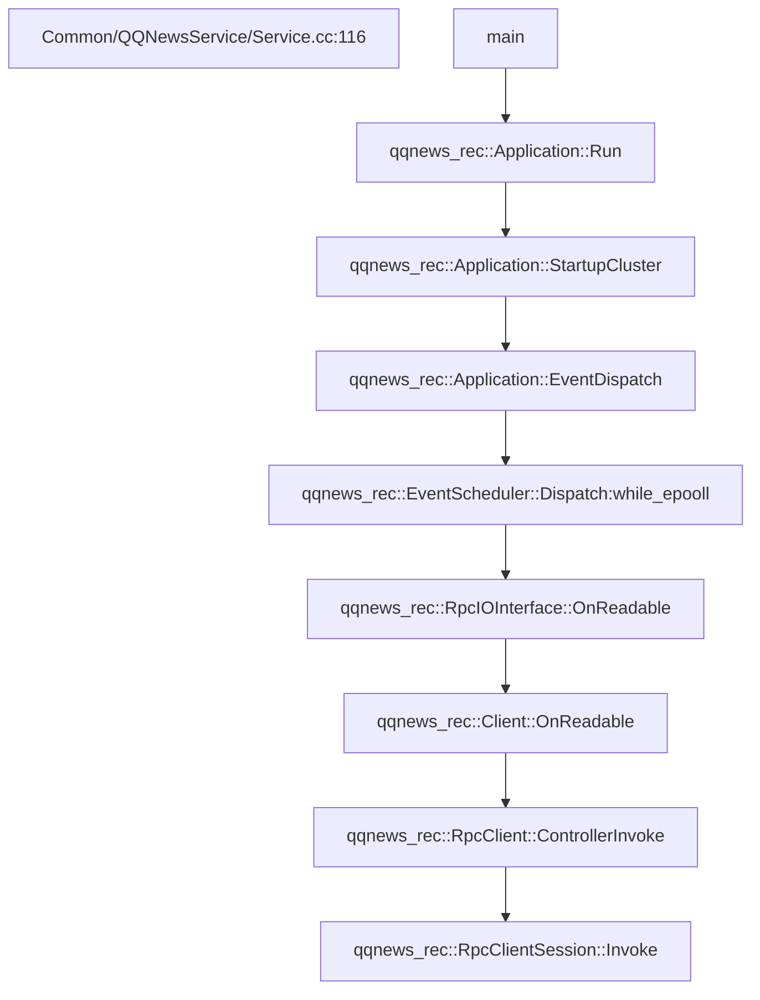
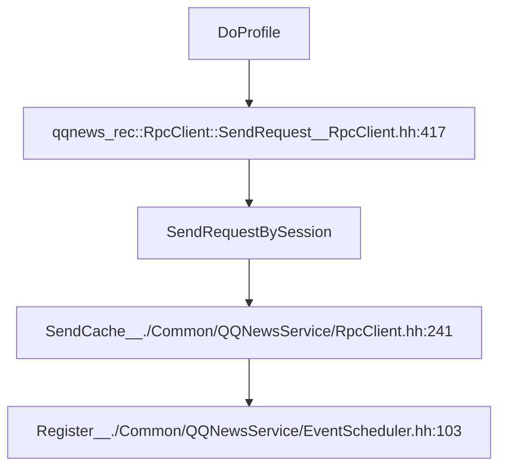
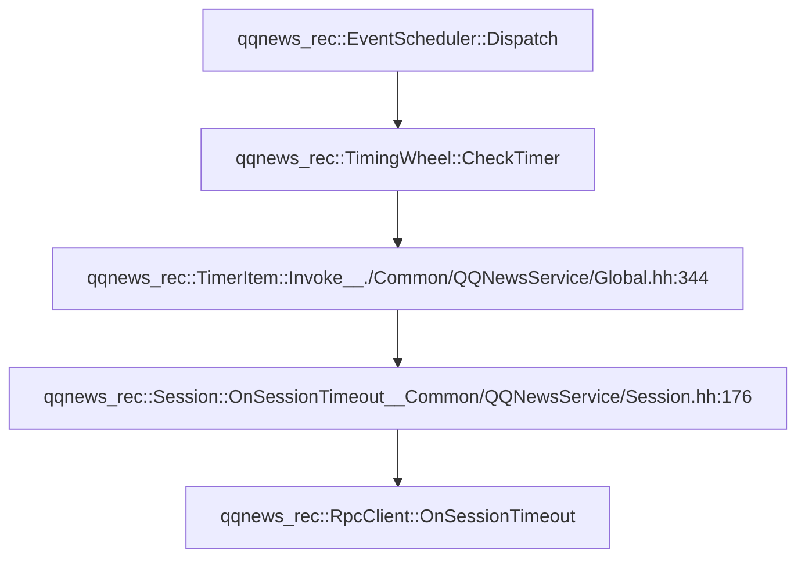

### 火锅推荐相关

`基本概念：`

- 策略
- trigger
- ranking
- rerank
- 画像



根据用户所在bucket（桶）和场景决定


#### PlayService




`架构：`





`定时器：`




```flow
st=>operation: GetRpcClient
cond=>condition: getConfig?
canExecute=>condition: canExecute
returnClient=>operation: returnClient
returnNullptr=>operation: returnNullptr
e=>end

st->cond
cond(yes)->canExecute
cond(no)->returnClient
canExecute(yes)->returnClient
canExecute(no)->returnNullptr


```

