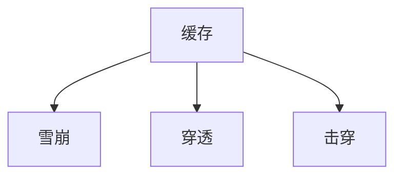

缓存

- 雪崩
  - 事前： redis考可用，主从+哨兵，redis cluster， 避免全盘崩溃
  - 事中： 本地ehcache缓存+hystrix限流&降级，避免MySQL被打死
  - 事后： redis持久化，一旦重启，自动从磁盘加载数据，快速恢复缓存数据
    

- 穿透

  
  设置空值

- 击穿
  缓存击穿，就是说某个 key 非常热点，访问非常频繁，处于集中式高并发访问的情况，当这个 key 在失效的瞬间，大量的请求就击穿了缓存，直接请求数据库，就像是在一道屏障上凿开了一个洞。
  解决方式也很简单，可以将热点数据设置为永远不过期；或者基于 redis or zookeeper 实现互斥锁，等待第一个请求构建完缓存之后，再释放锁，进而其它请求才能通过该 key 访问数据。

reference：

[什么是Redis的雪崩、穿透和击穿？崩溃之后会怎样？系统如何应对这种情况？如何处理Redis的穿透？](https://zhuanlan.zhihu.com/p/82980434?utm_source=wechat_session&utm_medium=social&utm_oi=56536915247104)

解决方式也很简单，可以将热点数据设置为永远不过期；或者基于 redis or zookeeper 实现互斥锁，等待第一个请求构建完缓存之后，再释放锁，进而其它请求才能通过该 key 访问数据。