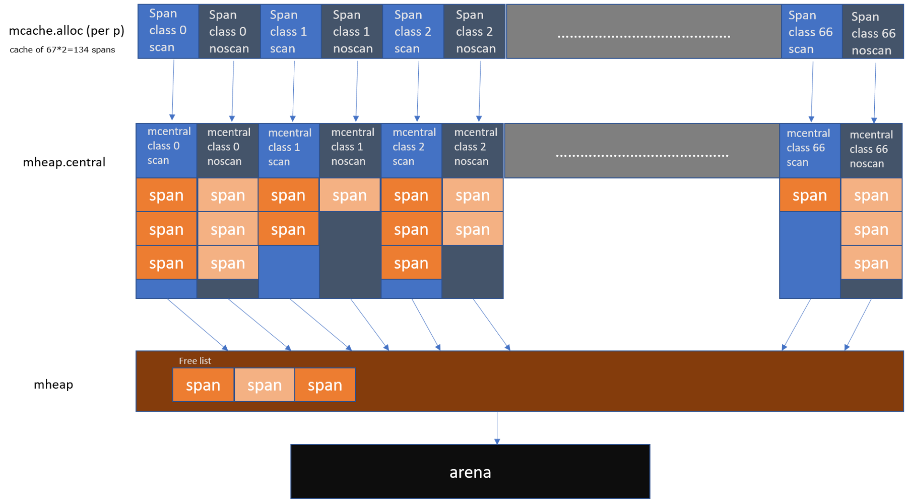

Go memory

---



- 每个 Gorontine 的运行都是绑定到一个 P 上面，mcache 是每个 P 的 cache。这么做的好处是分配内存时不需要加锁。

| 名称           | 描述                                                    |
| -------------- | ------------------------------------------------------- |
| mheap          | 当 mcentral 也不够用的时候，通过 mheap 向操作系统申请。 |
| mcentral       | 全局 cache，mcache 不够用的时候向 mcentral 申请。       |
| mspan          |                                                         |
| mcache         | per-P cache，可以认为是 local cache。                   |
| tiny allocator |                                                         |
| arena          |                                                         |


```go
// Per-thread (in Go, per-P) cache for small objects.
// No locking needed because it is per-thread (per-P).
type mcache struct {
    // The following members are accessed on every malloc,
    // so they are grouped here for better caching.
    next_sample int32   // trigger heap sample after allocating this many bytes
    local_scan  uintptr // bytes of scannable heap allocated

    // 小对象分配器，小于 16 byte 的小对象都会通过 tiny 来分配。
    tiny             uintptr
    tinyoffset       uintptr
    local_tinyallocs uintptr // number of tiny allocs not counted in other stats

    // The rest is not accessed on every malloc.
    alloc [_NumSizeClasses]*mspan // spans to allocate from

    stackcache [_NumStackOrders]stackfreelist

    // Local allocator stats, flushed during GC.
    local_nlookup    uintptr                  // number of pointer lookups
    local_largefree  uintptr                  // bytes freed for large objects (>maxsmallsize)
    local_nlargefree uintptr                  // number of frees for large objects (>maxsmallsize)
    local_nsmallfree [_NumSizeClasses]uintptr // number of frees for small objects (<=maxsmallsize)
}
```


ref: [A visual guide to Go Memory Allocator from scratch](https://blog.learngoprogramming.com/a-visual-guide-to-golang-memory-allocator-from-ground-up-e132258453ed)


####TCMalloc


基于 Page，分配小于Page的对象，但是如果分配的对象大于一个 Page，我们就需要用多个 Page 来分配了。这里提出了 Span 的概念，也就是多个连续的 Page 会组成一个 Span，在 Span 中记录起始 Page 的编号，以及 Page 数量。

分配对象时，大的对象直接分配 Span，小的对象从 Span 中分配。

page管理

ref: [图解 TCMalloc](https://zhuanlan.zhihu.com/p/29216091)