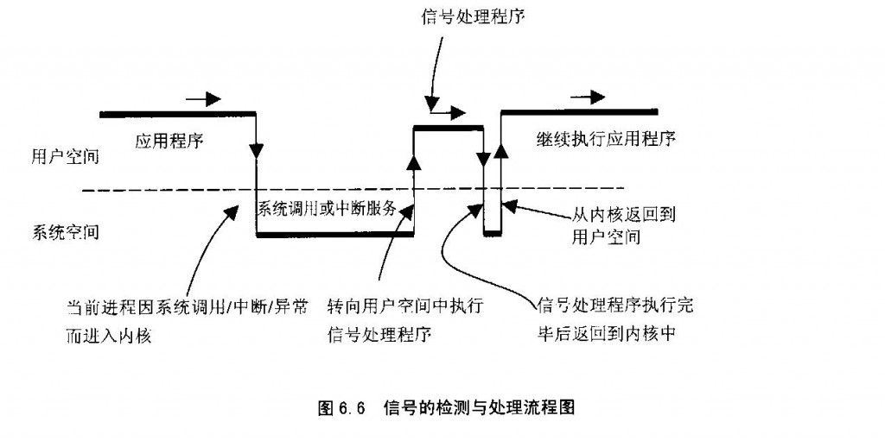
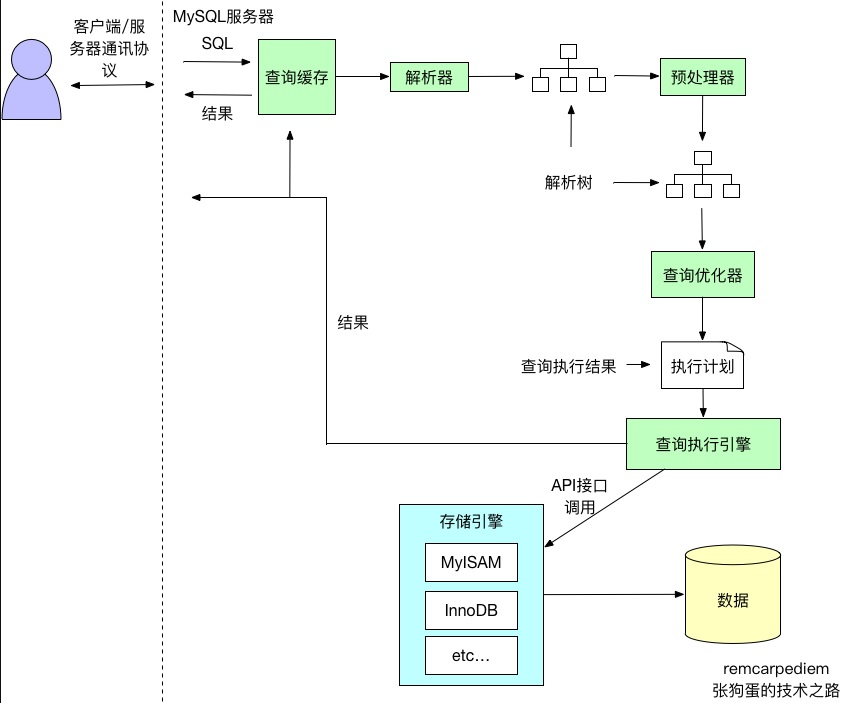
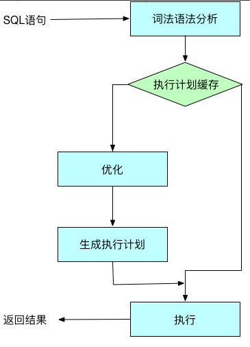
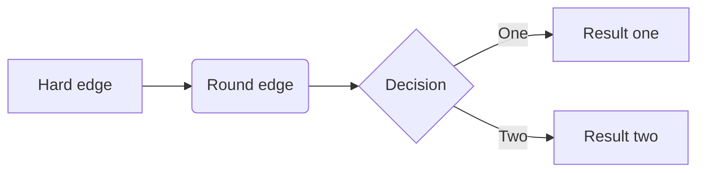

###summary

##### 基础知识题
HTTP 协议

HTTP 状态码 301、302、304 的作用。

**详细来说，301和302状态码都表示重定向**
`共同点`： 

- 就是说浏览器在拿到服务器返回的这个状态码后会自动跳转到一个新的URL地址，这个地址可以从响应的Location首部中获取（用户看到的效果就是他输入的地址A瞬间变成了另一个地址B）

`不同点`： 

 - 301表示旧地址A的资源已经被永久地移除了（这个资源不可访问了），搜索引擎在抓取新内容的同时也将旧的网址交换为重定向之后的网址； 
 - 302表示旧地址A的资源还在（仍然可以访问），这个重定向只是临时地从旧地址A跳转到地址B，搜索引擎会抓取新的内容而保存旧的网址。
 - 301 重定向是网页更改地址后对搜索引擎友好的最好方法，只要不是暂时搬移的情况,都建议使用301来做转址。

|状态码|含义|备注|
|-|-|-|
|301|301 redirect: 301 代表永久性转移(Permanently Moved)<br>请求一次后，服务器告诉客户端浏览器，永久重定向，下次再请求网页时不再请求远端服务器，客户端浏览器缓存了重定向的目标地址，但是，如果浏览器清空缓存后，浏览器重定向将失效，需要再次请求服务器。|
|302|302 redirect: 302 代表暂时性转移(Temporarily Moved )<br>每次客户端浏览器都需要请求服务器，服务器返回302，客户端浏览器，再根据响应头，请求相应的URL|
|304|内容未改变，在请求头里有：If-Modified-Since，在响应头里有：Last-Modified|

##### 数据库
- 如何设计合理的索引？
如果一个查询语句的索引是三星索引，那么它只需要进行一次磁盘的随机读及一个窄索引片的顺序扫描就可以得到全部的结果集
	- 第一颗星需要取出所有等值谓词中的列，作为索引开头的最开始的列（任意顺序）；
    	第一颗星不只是将等值谓词的列加入索引，它的作用是减少索引片的大小以减少需要扫描的数据行；
	- 第二颗星需要将 ORDER BY 列加入索引中；
    	第二颗星用于避免排序，减少磁盘 IO 和内存的使用；
	- 第三颗星需要将查询语句剩余的列全部加入到索引中；
    	第三颗星用于避免每一个索引对应的数据行都需要进行一次随机 IO 从聚集索引中读取剩余的数据；

- ACID是什么

|特性|描述|
|-|-|
|原子性（Atomicity）|事务包含的所有操作要么全部成功，要么全部失败回滚；<br>成功必须要完全应用到数据库，失败则不能对数据库产生影响；|
|一致性（Consistency）|事务执行前和执行后必须处于一致性状态|
|隔离性（Isolation）|当多个用户并发访问数据库时，数据库为每一个用户开启的事务，不被其他事务的操作所干扰，多个并发事务之间要相互隔离；|
|持久性（Durability）|一个事务一旦被提交了，那么对数据库中的数据的改变就是永久性的，即便在数据库系统遇到故障的情况下也不会丢失事物的操作。|
- 隔离级别
  |隔离级别|描述|特性|
  |-|-|
  |READ UNCIMMITTED（读未提交）|事务中的修改，即使没有提交，其他事务也可以看得到，比如说上面的两步这种现象就叫做脏读|最低级别，任何情况都会发生。|
  |READ COMMITTED（读已提交）|大多数数据库系统的默认隔离级别是READ COMMITTED，这种隔离级别就是一个事务的开始，只能看到已经完成的事务的结果，正在执行的，是无法被其他事务看到的。这种级别会出现读取旧数据的现象|可避免脏读的发生。|
  |Repeatable read(可重复读)|REPEATABLE READ解决了脏读的问题，该级别保证了每行的记录的结果是一致的，也就是上面说的读了旧数据的问题，但是却无法解决另一个问题，幻行，顾名思义就是突然蹦出来的行数据。指的就是某个事务在读取某个范围的数据，但是另一个事务又向这个范围的数据去插入数据，导致多次读取的时候，数据的行数不一致。|可避免脏读、不可重复读的发生。|
  |Serializable(串行化)|SERIALIZABLE是最高的隔离级别，它通过强制事务串行执行（注意是串行），避免了前面的幻读情况，由于他大量加上锁，导致大量的请求超时，因此性能会比较底下，再特别需要数据一致性且并发量不需要那么大的时候才可能考虑这个隔离级别|避免脏读、不可重复读，幻读的发生。|

  - 不同隔离级别产生的问题
    |问题|解释|
    |-|
    |脏读|是指一个事务处理过程里读取了另一个未提交的事务中的数据，然后使用了这个数据|
    |不可重复读|不可重复读是指在一个事务内，多次读取同一个数据，在这个事务还没有结束 ，另一个事务也访问该同一数据，但是由于第二个事务的修改，那么第一个事务两次读取的数据可能不一样，因此称为不可重复读；即同一个事务中原始数据读取不可重复。|
    |幻读|当事务不是独立执行时发生的一种现象，<br>例如：第一个事务对一个表中的数据进行修改，这种数据涉及到表中的全部数据行，同时，第二个事务也对这个表数据进行修改，这个修改是对表中新增/删除一条数据，那么操作第一个事务的用户发现表中的数据还没有修改的数据行，就好像发生了幻觉一样，这就是发生了幻读。|
    **注:幻读和不可重复读都读取另一条已经提交的事务，所不同的是不可重复读查询的都是同一数据项，而幻读针对的是一批数据整体。**

    |隔离级别|脏读|不可重复读|幻读|
    | ---- | ---- | ---- |
    |READ-UNCOMMITTED|✔|✔|✔|
    |READ-COMMITTED|✖|✔|✔|
    |REPEATABLE-READ|✖|✖|✔|
    |SERIALIZABLE|✖|✖|✖|

##### MVVC(Multi Version Concurrency Control多版本并发控制)
- MySQL中的InnoDB存储引擎的特性有，默认隔离级别REPEATABLE READ, 行级锁，实现了MVCC, Consistent nonlocking read(默认读不加锁，一致性非锁定读), Insert Buffer, Adaptive Hash Index, DoubleWrite, Cluster Index。
- Redo log, bin log, Undo log
	MySQL Innodb中存在多种日志，除了错误日志、查询日志外，还有很多和数据持久性、一致性有关的日志。
	- binlog，是mysql服务层产生的日志，常用来进行数据恢复、数据库复制，常见的mysql主从架构，就是采用slave同步master的binlog实现的, 另外通过解析binlog能够实现mysql到其他数据源的数据复制。
	- redo log记录了数据操作在物理层面的修改，mysql中使用了大量缓存，缓存存在于内存中，修改操作时会直接修改内存，而不是立刻修改磁盘，当内存和磁盘的数据不一致时，称内存中的数据为脏页(dirty page)。为了保证数据的安全性，事务进行中时会不断的产生redo log，在事务提交时进行一次flush操作，保存到磁盘中, redo log是按照顺序写入的，磁盘的顺序读写的速度远大于随机读写。当数据库或主机失效重启时，会根据redo log进行数据的恢复，如果redo log中有事务提交，则进行事务提交修改数据。这样实现了事务的原子性、一致性和持久性。
    - Undo Log除了记录redo log外，当进行数据修改时还会记录undo log，undo log用于数据的撤回操作，它记录了修改的反向操作，比如，插入对应删除，修改对应修改为原来的数据，通过undo log可以实现事务回滚，并且可以根据undo log回溯到某个特定的版本的数据，实现MVCC。
    - redo log 和binlog的一致性，为了防止写完binlog但是redo log的事务还没提交导致的不一致，innodb 使用了两阶段提交，大致执行序列为：
```python
InnoDB prepare  （持有prepare_commit_mutex）；
 write/sync Binlog；
 InnoDB commit (写入COMMIT标记后释放prepare_commit_mutex)。
```
```shell
- MVCC实现
InnoDB中通过B+树作为索引的数据结构，并且主键所在的索引为ClusterIndex(聚簇索引), ClusterIndex中的叶子节点中保存了对应的数据内容。一个表只能有一个主键，所以只能有一个聚簇索引，如果表没有定义主键，则选择第一个非NULL唯一索引作为聚簇索引，如果还没有则生成一个隐藏id列作为聚簇索引。 除了ClusterIndex外的索引是SecondaryIndex(辅助索引)。辅助索引中的叶子节点保存的是聚簇索引的叶子节点的值。
InnoDB行记录中除了刚才提到的rowid外，还有trx_id和db_roll_ptr, trx_id表示最近修改的事务的id,db_roll_ptr指向undo segment中的undo log。
```
新增一个事务时事务id会增加，trx_id能够表示事务开始的先后顺序。

4、B树的原理
- 定义:
    - 根结点至少有两个子女。
	- 每个中间节点都包含k-1个元素和k个孩子，其中 m/2 <= k <= m
	- 每一个叶子节点都包含k-1个元素，其中 m/2 <= k <= m
	- 所有的叶子结点都位于同一层。
	- 每个节点中的元素从小到大排列，节点当中k-1个元素正好是k个孩子包含的元素的值域分划。

5、堆排序的插入复杂度，数据结构是怎样的
10、用过哪些分布式消息队列，kafka的架构？offset如果管理？如何保证消息的顺序性？
11、https的原理
12、xss攻击
13、cookie、session概念
14、select和epoll的区别
  select优化点：
（1）被监控的fds集合限制为1024，1024太小了，我们希望能够有个比较大的可监控fds集合
（2）fds集合需要从用户空间拷贝到内核空间的问题，我们希望不需要拷贝
（3）当被监控的fds中某些有数据可读的时候，我们希望通知更加精细一点，就是我们希望能够从通知中得到有可读事件的fds列表，而不是需要遍历整个fds来收集。
**epoll相较于select高效在什么地方，需要比较两者做相同事情的方法**

- 用户态怎样将文件句柄传到内核态？
	- select创建3个文件描述符集，并将这些文件描述符拷贝到内核中，这里限制了文件句柄的最大的数量为1024（注意是全部传入---第一次拷贝）；
    - 首先执行epoll_create在内核专属于epoll的高速cache区，并在该缓冲区建立红黑树和就绪链表，用户态传入的文件句柄将被放到红黑树中（第一次拷贝）。
- 内核态怎么判断I/O流可读写？
	- 内核针对读缓冲区和写缓冲区来判断是否可读可写,这个动作和select无关；
    - 内核针对读缓冲区和写缓冲区来判断是否可读可写，这个动作与epoll无关；
- 内核怎么通知监控者有I/O流可读写？
	- 内核在检测到文件句柄可读/可写时就产生中断通知监控者select，select被内核触发之后，就返回可读可写的文件句柄的总数；
    - epoll_ctl执行add动作时除了将文件句柄放到红黑树上之外，还向内核注册了该文件句柄的回调函数，内核在检测到某句柄可读可写时则调用该回调函数，回调函数将文件句柄放到就绪链表。
- 监控者如何找到可读写的I/O流并传递给用户态程序？
	- select会将之前传递给内核的文件句柄再次从内核传到用户态（第2次拷贝），select返回给用户态的只是可读可写的文件句柄总数，再使用FD_ISSET宏函数来检测哪些文件I/O可读可写（遍历）；
    - epoll_wait只监控就绪链表就可以，如果就绪链表有文件句柄，则表示该文件句柄可读可写，并返回到用户态（少量的拷贝）；
- 继续循环监控时，监控者怎样重复上述步骤？
	- select对于事件的监控是建立在内核的修改之上的，也就是说经过一次监控之后，内核会修改位，因此再次监控时需要再次从用户态向内核态进行拷贝（第N次拷贝）
    - 由于内核不修改文件句柄的位，因此只需要在第一次传入就可以重复监控，直到使用epoll_ctl删除，否则不需要重新传入，因此无多次拷贝。

** epoll是继承了select/poll的I/O复用的思想，并在二者的基础上从监控IO流、查找I/O事件等角度来提高效率，具体地说就是内核句柄列表、红黑树、就绪list链表来实现的。 epoll高效的本质: 1.减少用户态和内核态之间的文件句柄拷贝； 2.减少对可读可写文件句柄的遍历；**
- ** 水平触发与边缘触发 **
	- 水平触发(level-trggered)
		- 只要文件描述符关联的读内核缓冲区非空，有数据可以读取，就一直发出可读信号进行通知，
		- 当文件描述符关联的内核写缓冲区不满，有空间可以写入，就一直发出可写信号进行通知
	- 边缘触发(edge-triggered)
		- 当文件描述符关联的读内核缓冲区由空转化为非空的时候，则发出可读信号进行通知，
		- 当文件描述符关联的内核写缓冲区由满转化为不满的时候，则发出可写信号进行通知

- ** epoll不足 **
	- 它不能在单次系统调用中多次更新兴趣集。当你的兴趣集中有100个文件描述符需要更新状态时，你不得不调用100次epoll_ctl()函数。
    - 非文件类型支持， “在unix中，所有东西都是文件”。但并不总是这样。例如时钟就不是，信号也不是，信号量也不是，包括进程也不是。无法对这些事物采用select()/poll()/epoll()的事件复用技术。为了避免这个问题，Linux提供了很多补充性质的系统调用，如signalfd()，eventfd()和timerfd_create()来转换非文件类型到文件描述符，这样你就可以使用epoll了。
    - 磁盘文件支持，epoll并不支持所有的文件描述符；select()/poll()/epoll()不能工作在常规的磁盘文件上。这是因为epoll有一个强烈基于准备就绪模型的假设前提。你监视的是准备就绪的套接字，因此套接字上的顺序IO调用不会发生阻塞。但是磁盘文件并不符合这种模型，因为它们总是处于就绪状态。

15、redis持久化

|方式|命令|解释|优点|缺点|
|-|
|RDB持久化（快照）|**save**: save命令会阻塞Redis服务器进程，直到RDB文件创建完毕为止，在Redis服务器阻塞期间，服务器不能处理任何命令请求<br>** bgsave**: 1. 服务器进程pid为1349派生出一个pid为1357的子进程，<br> 2. 子进程将数据写入到一个临时 RDB文件中<br> 3. 当子进程完成对新 RDB 文件的写入时，Redis 用新 RDB 文件替换原来的 RDB 文件，并删除旧的 RDB 文件。<br>**自动保存**: save 900 1    # 900 秒内有至少有 1 个键被改动<br> save 300 10   # 300 秒内有至少有 10 个键被改动<br> save 60 10000 # 60 秒内有至少有 1000 个键被改动|RDB持久化是指在客户端输入save、bgsave或者达到配置文件自动保存快照条件时，将Redis 在内存中的数据生成快照保存在名字为 dump.rdb（文件名可修改）的二进制文件中。|1. RDB是一个非常紧凑（有压缩）的文件,它保存了某个时间点的数据,非常适用于数据的备份。<br> 2. RDB作为一个非常紧凑（有压缩）的文件，可以很方便传送到另一个远端数据中心 ，非常适用于灾难恢复.<br> 3. RDB在保存RDB文件时父进程唯一需要做的就是fork出一个子进程,接下来的工作全部由子进程来做，父进程不需要再做其他IO操作，所以RDB持久化方式可以最大化redis的性能.<br> 4. 与AOF相比,在恢复大的数据集的时候，RDB方式会更快一些.|1. Redis意外宕机 时，会丢失部分数据<br>2. 当Redis数据量比较大时，fork的过程是非常耗时的，fork子进程时是会阻塞的，在这期间Redis 是不能响应客户端的请求的。|
|AOF持久化（只追加操作的文件 Append-only file）||AOF持久化是通过保存Redis服务器所执行的写命令来记录数据库状态，也就是每当 Redis 执行一个改变数据集的命令时（比如 SET）， 这个命令就会被追加到 AOF 文件的末尾。|1. 使用AOF会让你的Redis更加持久化<br>2. AOF文件是一个只进行追加的日志文件，不需要在写入时读取文件。<br>3. Redis 可以在 AOF 文件体积变得过大时，自动地在后台对 AOF 进行重写 。<br>4. AOF文件可读性高，分析容易|


16. kill信号原理：
   - 信号是异步的，一个进程不可能等待信号的到来，也不知道信号会到来，那么，进程是如何发现和接受信号呢？
   - 实际上，信号的接收不是由用户进程来完成的，而是由内核代理。当一个进程P2向另一个进程P1发送信号后，内核接受到信号，并将其放在P1的信号队列当中。当P1再次陷入内核态时，会检查信号队列，并根据相应的信号调取相应的信号处理函数。
     - 刚才我们说，当P1再次陷入内核时，会检查信号队列。那么，P1什么时候会再次陷入内核呢？陷入内核后在什么时机会检测信号队列呢？
     - 当前进程由于系统调用、中断或异常而进入系统空间以后，从系统空间返回到用户空间的前夕。
     - 当前进程在内核中进入睡眠以后刚被唤醒的时候（必定是在系统调用中），或者由于不可忽略信号的存在而提前返回到用户空间。
   - 进入信号处理函数
     发现信号后，根据信号向量，知道了处理函数，那么该如何进入信号处理程序，又该如何返回呢？ 我们知道，用户进程提供的信号处理函数是在用户态里的，而我们发现信号，找到信号处理函数的时刻处于内核态中，所以我们需要从内核态跑到用户态去执行信号处理程序，执行完毕后还要返回内核态。这个过程如下图所示：
     
     如图，处理信号的整个过程是这样的：进程由于系统调用或者中断进入内核，完成相应任务返回用户空间的前夕，检查信号队列，如果有信号，则根据信号向量表找到信号处理函数，设置好“frame”后，跳到用户态执行信号处理函数。信号处理函数执行完毕后，返回内核态，设置“frame”，再返回到用户态继续执行程序。
     - 什么叫Frame？
     - 在调用一个子程序时，堆栈要往下（逻辑意义上是往上）伸展，这是因为需要在堆栈中保存子程序的返回地址，还因为子程序往往有局部变量，也要占用堆栈中的空间。此外，调用子程序时的参数也是在堆栈中。子程序调用嵌套越深，则堆栈伸展的层次也越多。在堆栈中的每一个这样的层次，就称为一个”框架”，即frame。一般来说，当子程序和调用它的程序在同一空间中时，堆栈的伸展，也就是堆栈中框架的建立，过程主要如下：

       - call指令将返回地址压入堆栈（自动）
       - 用push指令压入调用参数
       - 调整堆栈指针来分配局部变量

#### 高并发理解：
简要总结梳理下，7点：
1. 逻辑剥离，只保留核心部分，而把附加功能剔除出去
	生成订单、扣除资金、库存扣减。
	非核心部分，短信发送、消息通知、销售统计、订单搜索等，通过MQ保证。

2. 提高数据库事务并发
	要提高数据库的事务并发数，最有效的办法是拆分，拆分有两种，一是对库进行拆分，另一种是在同一个库中对表进行拆分。
	数据库写库，通常只有1个，为了保证数据绝对一致。
	单个数据库的写库、并发性，有很大限制，通过分库16个、分表16*64=1024个。
	分库分表依据，订单号后4位，取模%1024。
	当当网开源的sharding-jdbc挺不错的。

3. 买家和卖家2个维度
	买家是1套库。 新增订单后，再发送MQ消息+定期对数据，同步到卖家库。

4. 历史数据
	3个月前的老数据迁移到其它库中。 用户查询时，分2次查询汇总。

5. 全数据的统计
	数据迁移到全量库中。难道是HBase之类的？

6. 搜索
	搜索和统计有点类似。 ElasticSearch。  京东淘宝都是10亿级别了吧。

7. 其它优化
	数据库、磁盘IO、服务器硬件稳定、压力测试

#### 内存泄露分析

#### SQL执行流程
1. 客户端发送一条查询给服务器。
2. 服务器先检查查询缓存，如果命中了缓存，则立刻返回存储在缓存中的结果。否则进入下一阶段。
3. 服务器端进行SQL解析、预处理，再由优化器生成对应的执行计划。
4. MySQL根据优化器生成的执行计划，再调用存储引擎的API来执行查询。
5. 将结果返回给客户端。


##### 查询缓存
- MySQL查询缓存保存查询返回的完整结构。当查询命中该缓存时，MySQL会立刻返回结果，跳过了解析、优化和执行阶段。 查询缓存系统会跟踪查询中涉及的每个表，如果这些表发生了变化，那么和这个表相关的所有缓存数据都将失效。 MySQL将缓存存放在一个引用表中，通过一个哈希值引用，这个哈希值包括了以下因素，即查询本身、当前要查询的数据库、客户端协议的版本等一些其他可能影响返回结果的信息。 当判断缓存是否命中时，MySQL不会进行解析查询语句，而是直接使用SQL语句和客户端发送过来的其他原始信息。所以，任何字符上的不同，例如空格、注解等都会导致缓存的不命中。 当查询语句中有一些不确定的数据时，则不会被缓存。例如包含函数NOW()或者CURRENT_DATE()的查询不会缓存。包含任何用户自定义函数，存储函数，用户变量，临时表，mysql数据库中的系统表或者包含任何列级别权限的表，都不会被缓存。 有一点需要注意，MySQL并不是会因为查询中包含一个不确定的函数而不检查查询缓存，因为检查查询缓存之前，MySQL不会解析查询语句，所以也无法知道语句中是否有不确定的函数。 事实则是，如果查询语句中包含任何的不确定的函数，那么其查询结果不会被缓存，因为查询缓存中也无法找到对应的缓存结果。 缓存命中率可以通过如下公式计算：Qcache_hits/(Qcache_hits + Com_select)来计算。有关查询缓存的配置如下所示:
	- query_cache_type:是否打开查询缓存。可以设置为OFF、ON和DEMAND。DEMAND表示只有在查询语句中明确写明SQL_CACHE的语句才会放入查询缓存。
	- query_cache_size:查询缓存使用的总内存空间。
	- query_cache_min_res_unit:在查询缓存中分配内存块时的最小单元。较小的该值可以减少碎片导致的内存空间浪费，但是会导致更频繁的内存块操作。
	- query_cache_limit:MySQL能够查询的最大查询结果。如果查询结果大于这个值，则不会被缓存。因为查询缓存在数据生成的时候就开始尝试缓存数据，所以当结果全部返回后，MySQL才知道查询结果是否超出限制。超出之后，才会将结果从查询缓存中删除。

##### 解析和预处理
- 解析器通过关键字将SQL语句进行解析，并生成对应的解析树。MySQL解析器将使用MySQL语法规则验证和解析查询。 预处理器则根据一些MySQL规则进行进一步检查解析书是否合法，例如检查数据表和数据列是否存在，还会解析名字和别名，看看它们是否有歧义。

##### 查询优化器
- 查询优化器会将解析树转化成执行计划。一条查询可以有多种执行方法，最后都是返回相同结果。优化器的作用就是找到这其中最好的执行计划。 生成执行计划的过程会消耗较多的时间，特别是存在许多可选的执行计划时。如果在一条SQL语句执行的过程中将该语句对应的最终执行计划进行缓存，当相似的语句再次被输入服务器时，就可以直接使用已缓存的执行计划，从而跳过SQL语句生成执行计划的整个过程，进而可以提高语句的执行速度。

- MySQL使用基于成本的查询优化器(Cost-Based Optimizer，CBO)。它会尝试预测一个查询使用某种执行计划时的成本，并选择其中成本最少的一个。 优化器会根据优化规则对关系表达式进行转换，这里的转换是说一个关系表达式经过优化规则后会生成另外一个关系表达式，同时原有表达式也会保留，经过一系列转换后会生成多个执行计划，然后CBO会根据统计信息和代价模型(Cost Model)计算每个执行计划的Cost，从中挑选Cost最小的执行计划。由上可知，CBO中有两个依赖：统计信息和代价模型。统计信息的准确与否、代价模型的合理与否都会影响CBO选择最优计划。

##### 查询执行引擎
- 解析和优化阶段，MySQL将生成查询对应的执行计划，MySQL的查询执行引擎根据这个执行计划来完成整个查询。这里执行计划是一个数据结构，而不是和其他的关系型数据库那样生成对应的字节码。

##### 返回结果给客户端
- 如果查询可以被缓存，那么MySQL在这个阶段页会将结果存放到查询缓存中。MySQL将结果集返回给客户端是一个增量、逐步返回的过程。在查询生成第一条结果时，MySQL就可以开始向客户端逐步返回结果集了。


----

#### Redis

| 知识点        | 相关问题                                                     | 解析                                                         |
| ------------- | ------------------------------------------------------------ | ------------------------------------------------------------ |
| rehash        |                                                              |                                                              |
| 常用数据类型  |                                                              | string、list、hash、zset、set、bit、pub/sub、hyperloglog、geo、bloomfilter |
| 分布式锁      |                                                              | 详见下面描述                                                 |
| 过期策略      |                                                              |                                                              |
| redis缓存穿透 | 缓存击穿表示恶意用户模拟请求很多缓存中不存在的数据，由于缓存中都没有，导致这些请求短时间内直接落在了数据库上，导致数据库异常。 | **1、使用互斥锁排队**<br />**2、布隆过滤器（推荐）**         |
| redis缓存雪崩 | 缓存在同一时间内大量键过期（失效），接着来的一大波请求瞬间都落在了数据库中导致连接异常。 | **1、使用互斥锁排队**<br />**2、建立备份缓存，缓存A和缓存B，A设置超时时间，B不设值超时时间，先从A读缓存，A没有读B，并且更新A缓存和B缓存;**<br />**3、key不要设置同时失效，固定缓存时间+随机时间解决** |
| redis缓存并发 | 一个缓存如果失效，可能出现多个进程同时查询DB，同时设置缓存的情况，如果并发确实很大，这也可能造成DB压力过大 |                                                              |

##### 分布式锁

使用 **setnx**(set if not exists) 指令，只允许被一个客户端设置成功（这里利用redis“单线程”特性），使用完之后，再调用 del 指令释放。

```python
redis.setnx("mylock", 1)
# do something
redis.delete("mylock")
```

如果程序出现异常，没机会调用del，那么就会陷入死锁，也就凉凉了。

于是我们想在拿到锁之后设置expire，变成如下流程

```python
redis.setnx("mylock", 1)
redis.expire("mylock", 3) # 需要毫秒级别可以使用pexpire
# do something
redis.delete("mylock")
```

还是不够严谨，如果再setnx之后，没来得及设置超时，挂掉了，之前的问题还存在，并没有完全解决掉。这种问题的根源就在于setnx和expire不是原子操作。也许会想到使用redis事物解决，但这里不行，因为expire是依赖于setnx的执行结果。于是Redis 2.8 版本中作者加入了 set 指令的扩展参数，setnx 和 expire 组合成原子指令

```python
redis.set("mylock", 1, ex=3, nx=True)
# do something
redis.delete("mylock")
```

以为用了扩展的set就万事大吉了，简直too youngh。这个分布式锁并不能解决**超时问题**，如果加锁和释放锁之间执行时间太长，以至于超出了锁的时限，就出两个问题，`1. 后来者拿到了本不该拿到的锁 2. 先来者可能释放掉已不属于它的锁。`为了避免这个问题，Redis锁不要用于较长时间的任务。

有个稍微安全一点的做法为set 指令的 value 参数设置为一个随机数，释放锁前先匹配值是否一致，然后再删除，可以确保当前占有的锁不会被其它释放，除非这个锁是过期了被服务器自动释放的。 但是匹配 value 和删除 key 不是一个原子操作，Redis 也没有提供类似于`delIfEquals`这样的指令，这就需要使用 Lua 脚本来处理了，因为 Lua 脚本可以保证连续多个指令的原子性执行。这个方法还是有缺陷的，它只解决了上述问题中的2，1并没有得到解决。

```python
if redis.set(key, random.nextint(), nx=True, ex=3):
    # do something
    redis.delIfEquals(key, tag)  # 假想的 delIfEquals 指令
```

锁发展到这一步，还有一个问题有待解决**`可重入性`**，可重入相关概念参考操作系统一节相关内容。解决方法大概思路：对当前流程拿到的redis锁做本地记录，申请redis锁之前先判断当前流程是否已拥有这个锁，并做引用计数+1，释放锁时先将引用计数-1，如果操作后值为0，则将redis锁释放掉。

```sequence
Title: "加锁流程"
routine->localRefNum: current refNum
localRefNum->routine: refNum
routine->localRefNum: refNum+1（refNum != 0）
localRefNum->routine: 取得锁
routine-->redis: set申请锁（refNum == 0）
redis-->routine: 取得锁
routine-->localRefNum: 设置localRefNum 1
```

```sequence
Title: "放锁流程"
routine->localRefNum: current refNum
localRefNum->routine: refNum
routine->localRefNum: refNum-1
routine-->redis: del释放锁（refNum == 0）
redis-->routine: 取得锁
```

到了这一步我能说还有问题吗？:cry:

在集群环境中，原先在mster中申请成功的锁，还没有来得及同步到slave，master挂掉时，slave会顶上，客户端上却并没明显感知，新的节点内部没有这个锁，所以另一个过来请求加锁时，立即就批准了。这样就会导致系统中同样一把锁被两个客户端同时持有。那么怎么解决这个问题呢？

---

##### 过期策略

redis会将设置了过期时间的key放到一个单独的字典(expires)，以后会有两种方式删除过期的key，`1. 集中处理:  定时遍历这个字典 2. 分散处理（惰性处理）: 访问key的时候，对key过期时间进行检查，如果过期了就立即删除。`

```c
/* Redis database representation. There are multiple databases identified
 * by integers from 0 (the default database) up to the max configured
 * database. The database number is the 'id' field in the structure. */
typedef struct redisDb {
    dict *dict;                 /* The keyspace for this DB */
    dict *expires;              /* Timeout of keys with a timeout set */
    dict *blocking_keys;        /* Keys with clients waiting for data (BLPOP)*/
    dict *ready_keys;           /* Blocked keys that received a PUSH */
    dict *watched_keys;         /* WATCHED keys for MULTI/EXEC CAS */
    int id;                     /* Database ID */
    long long avg_ttl;          /* Average TTL, just for stats */
} redisDb;
```

- 定时处理
- 惰性处理

```flow
main=>start: main
initServer=>operation: initServer
createTime=>operation: aeCreateTimeEvent
serverCron=>operation: serverCron
databasesCron=>operation: databasesCron
activeExpireCycle=>operation: activeExpireCycle
activeExpireCycleTryExpire=>operation: activeExpireCycleTryExpire
lazyfree_lazy_expire=>condition: lazyfree_lazy_expire?
dbSyncDelete=>operation: dbSyncDelete
dbAsyncDelete=>operation: dbAsyncDelete
main(right)->initServer(right)->createTime(right)->serverCron->databasesCron->activeExpireCycle->activeExpireCycleTryExpire->lazyfree_lazy_expire
lazyfree_lazy_expire(yes)->dbAsyncDelete
lazyfree_lazy_expire(no)->dbSyncDelete
```

```c
int activeExpireCycleTryExpire(redisDb *db, dictEntry *de, long long now) {
    long long t = dictGetSignedIntegerVal(de);
    if (now > t) {
        sds key = dictGetKey(de);
        robj *keyobj = createStringObject(key,sdslen(key));

        propagateExpire(db,keyobj,server.lazyfree_lazy_expire);
        if (server.lazyfree_lazy_expire)
            dbAsyncDelete(db,keyobj);
        else
            dbSyncDelete(db,keyobj);
        notifyKeyspaceEvent(NOTIFY_EXPIRED,
            "expired",keyobj,db->id);
        decrRefCount(keyobj);
        server.stat_expiredkeys++;
        return 1;
    } else {
        return 0;
    }
}
```


参考资料：

[Redis缓存穿透、缓存雪崩、redis并发问题分析](https://juejin.im/post/5b961172f265da0ab7198f4d)

----

####MySQL

| 知识点         | 相关问题                     | 解析         |
| -------------- | ---------------------------- | ------------ |
| 数据类型       | char、varchar、text区别      |              |
| 索引类型       | B、B+、Hash                  |              |
| 索引设计       | 三星原则                     |              |
| InnoDB，MyISAM |                              |              |
| ACID           |                              |              |
| 悲观锁/乐观锁  |                              |              |
| MVVC           |                              | 参考下面详述 |
| 锁分类、原理   | 表锁，页锁，行锁<br />间隙锁 |              |
| 查询优化       |                              | explain      |
| 行锁算法       |                              |              |

#####MVVC 

在MVCC并发控制中，读操作可以分成两类：快照读 (snapshot read)与当前读 (current read)。

 - 快照读，读取的是记录的可见版本 (有可能是历史版本)，不用加锁。

   ```sql
   select * from table where ?;
   ```

 - 当前读，读取的是记录的最新版本，并且，当前读返回的记录，都会加上锁，保证其他事务不会再并发修改这条记录。

   ```sql
   select * from table where ? lock in share mode; -- S锁 (共享锁)
   select * from table where ? for update; -- X锁 (排它锁)
   insert into table values (…); -- X锁 (排它锁)
   update table set ? where ?; -- X锁 (排它锁)
   delete from table where ?; -- X锁 (排它锁)
   ```

   ***为什么将 插入/更新/删除 操作，都归为当前读？***

   ```sequence
   Title: "update table set ? where ?"
   MySQL Server->InnoDB: current read(round 1)
   InnoDB-->MySQL Server: return & lock(round 1)
   MySQL Server->InnoDB: update row(round 1)
   InnoDB-->MySQL Server: success(round 1)
   Note over MySQL Server,InnoDB: round N
   
   ```

delete操作也如上图所示，Insert操作会稍微有些不同，简单来说，就是Insert操作可能会触发Unique Key的冲突检查，也会进行一个当前读。

**注**：<u>根据上图的交互，针对一条当前读的SQL语句，InnoDB与MySQL Server的交互，是一条一条进行的，因此，加锁也是一条一条进行的。先对一条满足条件的记录加锁，返回给MySQL Server，做一些DML操作；然后在读取下一条加锁，直至读取完毕。</u>

| 隔离级别                 | 备注                                                         |
| ------------------------ | ------------------------------------------------------------ |
| **Read Uncommited**      | 可以读取未提交记录。此隔离级别，不会使用，忽略。             |
| **Read Committed (RC)**  | 快照读忽略，本文不考虑。<br />针对当前读，RC隔离级别保证对读取到的记录加锁 (记录锁)，存在幻读现象。 |
| **Repeatable Read (RR)** | 快照读忽略，本文不考虑。<br />针对当前读，RR隔离级别保证对读取到的记录加锁 (记录锁)，同时保证对读取的范围加锁，新的满足查询条件的记录不能够插入 (间隙锁)，不存在幻读现象。 |
| **Serializable**         |从MVCC并发控制退化为基于锁的并发控制。不区别快照读与当前读，所有的读操作均为当前读，读加读锁 (S锁)，写加写锁 (X锁)。<br />Serializable隔离级别下，读写冲突，因此并发度急剧下降，在MySQL/InnoDB下不建议使用。|

##### 行锁算法

- Record Lock
- Gap Lock
- Next-Key Lock

**参考资料**：

[MySQL 加锁处理分析](http://hedengcheng.com/?p=771)

----

#### 算法

| 大类     | 使用原则 | 细化                                             | 例子     |
| -------- | -------- | ------------------------------------------------ | -------- |
| 分治法   |          |                                                  | 快速排序 |
| 减治法   |          |                                                  | 插入排序 |
| 动态规划 |          |                                                  | 斐波那契 |
| 暴力枚举 |          |                                                  |          |
| BFS/DFS  |          |                                                  |          |
| 双指针   |          |                                                  |          |
| 排序     |          | 选择，冒泡，插入，快速，归并，希尔，基数，堆排序 |          |
| 递归     |          |                                                  | 汉诺塔   |

##### 双指针

给定一个数组和一个值，原地删除该值的所有实例并返回新的长度。

如果我们没有空间复杂度上的限制，那就更容易了。我们可以初始化一个新的数组来存储答案。如果元素不等于给定的目标值，则迭代原始数组并将元素添加到新的数组中。
实际上，它相当于使用了两个指针，一个用于原始数组的迭代，另一个总是指向新数组的最后一个位置。

```go
// 给定一个数组 nums 和一个值 val，你需要原地移除所有数值等于 val 的元素，返回移除后数组的新长度。
func removeElement(nums []int, val int) int {
    ans := 0
    for i, v := range nums{
        if v != val {
            nums[ans] = nums[i]
            ans ++
        }
    }
    
    return ans
}
```




----

####数据结构

| 大类         | 细化                   | 实现 | 题                             |
| ------------ | ---------------------- | ---- | ------------------------------ |
| 数组         |                        |      |                                |
| 链表         |                        |      | 链表逆序，链表环检测           |
| 队列         |                        |      |                                |
| 跳表         |                        |      |                                |
| 二叉树       |                        |      | 先序，中序，后序，层序，树高度 |
| 平衡二叉树   | AVL，RB                |      |                                |
| 基数树       |                        |      |                                |
| trie         |                        |      |                                |
| B树          |                        |      |                                |
| B+树         |                        |      |                                |
| 堆           |                        |      | topk，堆排序                   |
| Treap        | Tree + Heap            |      |                                |
| 并查集       |                        |      |                                |
| 栈           |                        |      | 括号匹配，带最小函数的栈       |
| Hash         | 开放地址法<br />链表法 |      |                                |
| 一致性Hash   | vnode                  |      |                                |
| Bloom Filter |                        |      |                                |
| 图           |                        |      |                                |
| 字符串处理   |                        |      | 字符串匹配                     |

----

#### 分布式

| 知识点     | 解析     |
| ---------- | -------- |
| CAP        |          |
| BASE       |          |
| 两段式提交 |          |
| 三段式提交 |          |
| Paxos      |          |
| Raft       |          |
| 分布式事物 |          |
| 相关组件   | zk，etcd |

##### 分布式与集群的区别

`分布式`:  一个业务拆分成多个子业务，部署在不同的服务器上

`集群`： 同一个业务，部署在多个服务器上

例如：电商系统可以拆分成商品，订单，用户等子系统。这就是分布式，而为了应对并发，同时部署好几个用户系统，这就是集群。

```flow
single=>start: 单应用架构(应用&数据服务)
seperate=>operation: 应用服务器和数据服务器分离
cluster=>operation: 应用服务器做集群

single(right)->seperate(right)->cluster
```

单机负载越来越难，所以要将应用服务器和数据库服务器分离，每个系统的处理能力是有限的，为了提高并发访问量，需要对应用服务器做集群。

这是会涉及两个问题：

- 负载均衡
  - DNS
    DNS是最简单也是最常见的负载均衡方式，一般用来实现地理级别的均衡。例如，北方的用户访问北京的机房，南方的用户访问广州的机房。一般不会使用DNS来做机器级别的负载均衡，因为太耗费IP资源了。例如，百度搜索可能要10000台以上的机器，不可能将这么多机器全部配置公网IP，然后用DNS来做负载均衡。
  - Nginx&LVS&F5
    Nginx&LVS&F5用于同一地点内机器级别的负载均衡。其中Nginx是软件的7层负载均衡，LVS是内核的4层负载均衡，F5是硬件做4层负载均衡，性能从低到高位Nginx<LVS<F5
  - 
- session共享
  - session sticky
    将请求都落到同一个服务器上，如Nginx的url hash
  - session replication
    session复制，每台服务器都保存一份相同的session
  - session集中存储
    存储在db、 存储在缓存服务器 （redis）
  - cookie（主流）
    将信息存在加密后的cookie中

##### 读写分离

**数据库读写分离的基本实现如下:**

1. 数据库服务器搭建主从集群，一主一从，一主多从都可以
2. 数据库主机负责读写操作，从机只负责读操作
3. 数据库主机通过复制将数据同步到从机，每台数据库服务器都存储了所有的业务数据
4. 业务服务器将写操作分给数据库主机，将读操作分给数据库从机

**实现方式：**

1. 程序代码封装
2. 中间件封装

##### 分库分表

**业务分库：**业务分库指的是`按照业务模块将数据分散到不同的数据库服务器`。例如，一个简单的电商网站，包括商品，订单，用户三个业务模块，我们可以将商品数据，订单数据，用户数据，分开放到3台不同的数据库服务器上，而不是将所有数据都放在一台数据库服务器上。引入问题如下：

- `join操作问题`：业务分库后，原本在同一个数据库中的表分散到不同数据库中，导致无法使用SQL的join查询
- `事务问题`：原本在同一个数据库中不同的表可以在同一个事务中修改，业务分库后，表分散到不同数据库中，无法通过事务统一修改
- `成本问题`：业务分库同时也带来了成本的代价，本来1台服务器搞定的事情，现在要3台，如果考虑备份，那就是2台变成6台

**分表**

- 垂直分表
  垂直分表适合将表中某些不常用且占了大量空间的列拆分出去。如上图的nickname和description字段不常用，就可以将这个字段独立到另外一张表中，这样在查询name时，就能带来一定的性能提升
- 水平分表
  水平分表适合表行数特别大的表，如果单表行数超过5000万就必须进行分表，这个数字可以作为参考，但并不是绝对标准，关键还是要看表的访问性能
  水平分表后，某条数据具体属于哪个切分后的子表，需要增加路由算法进行计算，常见的**路由算法**有：
  - **范围路由**：选取有序的数据列（例如，整型，时间戳等）作为路由条件，不同分段分散到不同的数据库表中。以最常见的用户ID为例，路由算法可以按照1000000的范围大小进行分段，1-999999放到数据库1的表中，1000000-1999999放到数据库2的表中，以此类推
  - **Hash路由**：选取某个列（或者某几个列组合也可以）的值进行Hash运算，然后根据Hash结果分散到不同的数据库表中。同样以用户Id为例，假如我们一开始就规划了10个数据库表，路由算法可以简单地用user_id%10的值来表示数据所属的数据库表编号，ID为985的用户放到编号为5的子表中，ID为10086的用户放到编号为6的子表中。
  - **配置路由**：配置路由就是路由表，用一张独立的表来记录路由信息，同样以用户ID为例，我们新增一张user_router表，这个表包含user_id和table_id两列，根据user_id就可以查询对应的table_id

#### 语言

| 语言 | 考点                                                         |                                                              |
| ---- | ------------------------------------------------------------ | ------------------------------------------------------------ |
| GO   | slice，map，channel实现<br />GC，协程调度<br />defer<br />协程实现<br />性能分析（profile， trace） |                                                              |
| C++  | 虚函数，虚表<br />设计模式<br />Modern C++<br />模板<br />static用法<br />STL<br />shared_ptr<br />Boost | 理解对象的内存布局，即可理解虚函数，虚表<br />常用设计模式，单例（较重要，会手写），工厂（连接池），观察者（pub/sub），装饰器<br />C++11，lambda，auto，final<br />可变参数模板<br />修饰变量，修饰函数，修饰类成员<br />vector，list，map，unordered_map（hash map），set，unordered_set |

#### 操作系统

| 知识点           | 解析 | 考题         |
| ---------------- | ---- | ------------ |
| 进程，线程，协程 |      |              |
| 内存，cpu缓存    |      | 内存拷贝优化 |
| 文件系统         |      | 关闭swap     |
| 信号             |      | kill实现原理 |
| 磁盘             |      | 页缓存       |
| 线程安全vs可重入 |      |              |

#### 网络

| 知识点              | 解析 | 考题                                                         |
| ------------------- | ---- | ------------------------------------------------------------ |
| 三次握手            |      |                                                              |
| 四次挥手            |      |                                                              |
|                     |      |                                                              |
| sync队列，就绪队列  |      |                                                              |
| 网络优化            |      |                                                              |
| epoll、poll、select |      | poll、select、epoll比较<br />epoll高效原因<br />epoll有啥缺点 |
| TIME_WAIT           |      |                                                              |

##### 三次握手

```sequence
client->server: sync(i)
server->client: sync(i+1) ack(j)
client->server: ack(j+1)
```


#### 常用组件

| 组件       | 使用场景 |
| ---------- | -------- |
| etcd       |          |
| kong       |          |
| zipkin     |          |
| prometheus |          |
| kafka      |          |
| nginx      |          |

#### 架构

| 知识点   | 解析 |
| -------- | ---- |
| failover |      |


#### 常见题目

1. 单例模式

   ```c++
   #include <pthread.h>
   
   // 单线程版
   namespace v1 {
       class singleton {
           private:
               static singleton* p;  
               singleton(){}  // 防止被外部实例化
           public:
               static singleton* instance();
       };
   
       singleton* singleton::p = nullptr;
       singleton* singleton::instance() {
           if (p == nullptr) {
               p = new singleton();
           }
           return p;
       }
   }
   
   // 加锁的经典懒汉实现
   namespace v2 {
       class singleton {
           protected:
               singleton() {
                   pthread_mutex_init(&mutex, nullptr);
               }
           private:
               static singleton* p;
           public:
               static pthread_mutex_t mutex;
               static singleton* initance();
       };
   
       pthread_mutex_t singleton::mutex;
       singleton* singleton::p = nullptr;
       singleton* singleton::initance() {
           if (p == nullptr) {
               pthread_mutex_lock(&mutex);
               if (p == nullptr) {
                   p = new singleton();
               }
               pthread_mutex_unlock(&mutex);
           }
           return p;
       }
   }
   
   // 内部静态变量的懒汉实现
   namespace v3 {
       class singleton {
           protected:
               singleton() {
                   pthread_mutex_init(&mutex, nullptr);
               }
           public:
               static pthread_mutex_t mutex;
               static singleton* initance();
       };
   
       pthread_mutex_t singleton::mutex;
       singleton* singleton::initance() {
           pthread_mutex_lock(&mutex);
           static singleton obj;
           pthread_mutex_unlock(&mutex);
           return &obj;
       }
   }
   
   // 饿汉实现 
   namespace v4 {
       class singleton {
           protected:
               singleton() {}
           private:
               static singleton* p;
           public:
               static singleton* initance();
       };
       singleton* singleton::p = new singleton; // 进入主函数之前就由主线程以单线程方式完成了初始化
       singleton* singleton::initance() {
           return p;
       }
   }
   ```

2. 链表有环检测

   ```c++
   // 时间复杂度O(n)，空间复杂度O(n)
   class Solution {
   public:
       bool hasCycle(ListNode *head) {
           unordered_set<ListNode*> s;
           
           while (head) {
               auto v = s.find(head);
               if (v != s.end()) {
                   return true;
               }
               s.insert(head);
               head = head->next;
           }
           
           return false;
       }
   };
   
   // 时间复杂度O(n)，空间复杂度O(1)
   class Solution {
   public:
       bool hasCycle(ListNode *head) {
           if (head == nullptr) {
       		return false;
       	}
   
       	ListNode *fast = head;
       	ListNode *slow = head;
   
       	while (fast->next != nullptr) {
       		fast = fast->next->next;
       		if (fast == nullptr) {
       			return false;
       		}
   
       		slow = slow->next;
       		if (fast == slow) {
       			return true;
       		}
       	}
       	return false;
       }
   };
   ```

3. 链表原地逆序

   ```c++
   class Solution {
       public:
           ListNode* reverseList(ListNode* head) {
               if (head == NULL) {
                   return head;
               }
               ListNode* curr = head;
               ListNode* next = head->next;
               head->next = NULL;
               ListNode* tmp = NULL;
               while (next != NULL) {
                   tmp = next->next;
                   next->next = curr;
                   curr = next;
                   next = tmp;
               }
               return curr;
           }
   
   };
   ```

4. 二叉树先序遍历
   递归、非递归两种方法。递归较容易，所以只提供非递归的答案

   ```c++
   class Solution {
       public:
           vector<int> preorderTraversal(TreeNode* root) {
               vector<int> ans;
               stack<TreeNode*> s;
               while (root != nullptr || !s.empty()) {
                   if (root) {
                       ans.push_back(root->val);
                       if (root->right != nullptr) {
                           s.push(root->right);
                       }    
                       if (root->left != nullptr) {
                           s.push(root->left);
                       } 
                   } else {
                       root = s.top();
                       s.pop();
                       ans.push_back(root->val);
                       if (root->right != nullptr) {
                           s.push(root->right);
                       }    
                       if (root->left != nullptr) {
                           s.push(root->left);
                       } 
                   }
                   root = nullptr;
               }
               return ans;
           }
   };
   ```

5. 二叉树中序遍历

6. 二叉树后续遍历

   ```c++
   class Solution {
       public:
           vector<int> postorderTraversal(TreeNode* root) {
               vector<int> ans;
               stack<pair<TreeNode*, int>> s;
   
               if (root == nullptr) {
                   return ans;
               }
   
               s.push(pair<TreeNode*, int>(root, 1));
   
               while (!s.empty()) {
                   auto e = s.top();
                   s.pop();
                   if (e.second == 2) {
                       ans.push_back(e.first->val);
                   } else {
                       s.push(pair<TreeNode*, int>(e.first, e.second+1));
                       if (e.first->right) {
                           s.push(pair<TreeNode*, int>(e.first->right, 1));
                       }
                       if (e.first->left) {
                           s.push(pair<TreeNode*, int>(e.first->left, 1));
                       }
                   }
               }
               return ans;
           }
   
   };
   ```

7. 二叉树层序遍历

   ```c++
   class Solution {
   public:
       vector<vector<int>> levelOrder(TreeNode* root) {
           vector<vector<int>> result;
           if (nullptr == root) {
               return result;
           }
           queue<TreeNode*> q;
           TreeNode* n;
           q.push(root);
           while (!q.empty()) {
               vector<int> level;
               size_t count = q.size();
               while (count --) {
                   n = q.front();
                   level.push_back(n->val);
                   q.pop();
                   
                   if (n->left) {
                       q.push(n->left);
                   }
                   if (n->right){
                       q.push(n->right);
                   }
               }
               result.push_back(level);
           }
           return result;
       }
   };
   ```

8. BFS

9. DFS

10. 链表中倒数第K个节点

    ```c++
    class Solution {
    public:
        ListNode* removeNthFromEnd(ListNode* head, int n) {
            if (head == nullptr) {
                return nullptr;
            }
            ListNode* front = head;
            while (n && front) {
                front = front->next;
                n --;
            }
            if (front) {
                front = front->next;
            }else {
                return head->next;
            }
            ListNode* back = head;
            while (front) {
                back = back->next;
                front = front->next;
            }
            if (back && back->next) {
                back->next = back->next->next;
            } else {
                return nullptr;
            }
            return head;
        }
    };
    ```

11. 包含min函数的栈

    ```c++
    class MinStack {
        public:
            /** initialize your data structure here. */
            MinStack() { }
    
            void push(int x) {
                m_data.push(x);
                if (m_min.empty() || x <= m_min.top()) {
                    m_min.push(x);
                }
            }
    
            void pop() {
                if (m_data.top() == m_min.top()) {
                    m_min.pop();
                }
                m_data.pop();
            }
    
            int top() {
                return m_data.top();
            }
    
            int getMin() {
                return m_min.top();
            }
        private:
            stack<int> m_data;
            stack<int> m_min;
    
    };
    ```

12. 找出数组中超过一半元素

    ```c++
    class Solution {
    public:
        // 每找出两个不同的element，则成对删除。最终剩下的一定就是所求的。
        int majorityElement(vector<int>& nums) {
            int cnt = 0;
            int ans;
            
            for (auto x : nums) {
                if (cnt == 0) {
                    ans = x;
                    cnt ++;
                } else if (ans == x) {
                    cnt ++;
                } else {
                    cnt --;
                }
            }
            
            return ans;
        }
    };
    ```
